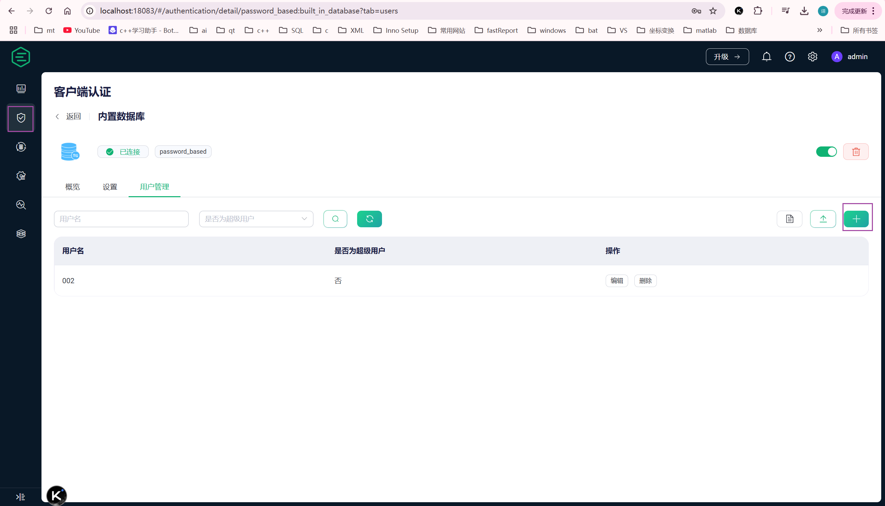

MQTT 学习笔记  
    
# 资源  
> [MQTT - The Standard for IoT Messaging](https://mqtt.org/)  
> [MQTT Specification](https://mqtt.org/mqtt-specification/)  
> [MQTT V3.1 Protocol Specification](https://public.dhe.ibm.com/software/dw/webservices/ws-mqtt/mqtt-v3r1.html)  
> [MQTT Version 3.1.1](http://docs.oasis-open.org/mqtt/mqtt/v3.1.1/os/mqtt-v3.1.1-os.html)  
> [MQTT Version 5.0](https://docs.oasis-open.org/mqtt/mqtt/v5.0/os/mqtt-v5.0-os.html)  
> [MQTT Guide 2024: Beginner to Advanced](https://www.emqx.com/en/mqtt-guide)  
> [rfc5246](https://www.rfc-editor.org/rfc/inline-errata/rfc5246.html)  
    
MQTT（Message Queuing Telemetry Transport，消息队列遥测传输）是一种轻量级的消息传输协议，专为简单、高效的信息传输设计。  
    
# MQTT broker  
## windows 使用EMQX broker  
> [EMQX Documentation](https://docs.emqx.com/en/)  
> [Legacy Documentation | EMQ](https://docs.emqx.com/en/legacy.html)  
    
### 安装  
> [Get Started with EMQX | EMQX Docs](https://docs.emqx.com/en/emqx/latest/getting-started/getting-started.html)  
> [The World's Leading Open Source IoT Software](https://www.emqx.com/zh/downloads/broker)  
> [Windows | EMQX 5.3 Docs](https://docs.emqx.com/en/emqx/v5.3/deploy/install-windows.html)  
    
- 下载软件安装包，如 5.3.2 版本  
- 解压，然后在解压后的目录中运行  
```bash  
./bin/emqx.cmd start  
```  
    
### Web 管理界面  
windows 本地安装，默认地址和端口：http://localhost:18083  
windows 本地安装，默认用户和密码：admin (default password: public)  
可以修改密码，如改为：emqx123456，或者跳过  
    
### 配置文件  
解压目录后的 etc  目录下的 emqx.conf 为默认配置文件  
    
在 etc\examples 目录下有示例配置文件，如 `listeners.ssl.conf.example` 为配置 SSL 监听的配置文件  
    
### 客户端认证 Authentication  
  
    
#### 用户名密码认证  
  
    
### 客户端授权 Authorization  
> [GAuthorization in MQTT: Using ACLs to Control Access to MQTT Messaging(https://www.emqx.com/en/blog/authorization-in-mqtt-using-acls-to-control-access-to-mqtt-messaging)  
    
### tls 配置  
> [开启 SSL/TLS 连接 | EMQX文档](https://docs.emqx.com/zh/emqx/latest/network/emqx-mqtt-tls.html#通过配置文件配置)  
> [开启 SSL/TLS 连接 | EMQX 文档](https://docs.emqx.com/zh/emqx/latest/network/emqx-mqtt-tls.html)  
  
#### 配置文件配置  
在 etc\examples 目录下有示例配置文件，如 `listeners.ssl.conf.example` 为配置 SSL 监听的配置文件  
    
#### 界面配置  
在 web 管理界面中配置：  
  
  
  
#### tls 单向认证  
> [开启 SSL/TLS 连接 | EMQX 文档](https://docs.emqx.com/zh/emqx/latest/network/emqx-mqtt-tls.html#单向认证客户端测试)   
  
##### MQTTX 作为客户端配置  
> [开始使用](https://mqttx.app/zh/docs/get-started)   
  
- broker 证书 CN 字段需要与服务器的地址匹配  
  
###### broker 自签名证书  
- mqttx 打开 SSL Secure，连接失败  
- mqttx 关闭 SSL Secure，连接成功  
   
###### broker 证书为 CA 颁发的证书  
- mqttx 打开 SSL Secure，连接失败  
    
broker 的配置如下：  
```bash  
node {  
  name = "emqx@127.0.0.1"  
  cookie = "emqxsecretcookie"  
  data_dir = "data"  
}  
  
cluster {  
  name = emqxcl  
  discovery_strategy = manual  
}  
  
dashboard {  
    listeners.http {  
        bind = 18083  
    }  
    #listeners.https {  
    #    bind = 18084  
    #    certfile = "${EMQX_ETC_DIR}/certs/IND400/certificate.pem"  
    #    keyfile = "${EMQX_ETC_DIR}/certs/IND400/private.pem"  
    #}  
}  
  
listeners.ssl.default {  
  bind = "0.0.0.0:8883"  
  ssl_options {  
    # PEM 格式的文件，包含一个或多个用于验证客户端证书的根 CA 证书  
    # 单向认证时，cacertfile 文件内容可以为空, 用于验证客户端证书的 CA  
    cacertfile = "etc/certs/ca/ca_root.pem"  
#    PEM 格式的服务器证书，如果证书不是直接由根 CA 签发，那么中间 CA 的证书必须加在服务器证书的后面组成一个证书链  
    certfile = "etc/certs/levelone/emqx.pem"  
#    PEM 格式的密钥文件  
    keyfile = "etc/certs/levelone/emqx_key.pem"  
    # 设置成 'verify_peer' 来验证客户端证书是否为 cacertfile 中某个根证书签发。双向认证时，必须设置成 'verify_peer'。  
    # 设置成 'verify_none' 则不验证客户端证书，即单向认证。  
    verify = verify_none  
    # 如果设置成 true，但是客户端在握手时候没有发送证书，服务端会终止握手。双向认证时，必须设置成 true。  
    # 如果设置成 false，那么服务端只有在客户端发送一个非法证书时才会终止握手  
    fail_if_no_peer_cert = false  
    #versions = [tlsv1.3, tlsv1.2]  
    versions = [tlsv1.2]  
  }  
}  
```  
  
MQTTX 客户端配置：打开 SSL/TLS，打开 SSL Secure，Certificate 选则 CA or Self Signed Certificate，然后在 CA File 中填写 CA证书文件路径。  
  
#### tls 双向认证  
    
##### MQTTX 作为客户端使用和 broker 相同的 CA 颁发的证书  
- emqx 证书使用 CA 颁发的证书  
- mqttx 证书使用和 emqx 相同的 CA 颁发的证书  
- 连接成功  
  
broker 的配置如下：  
```bash  
node {  
  name = "emqx@127.0.0.1"  
  cookie = "emqxsecretcookie"  
  data_dir = "data"  
}  
  
cluster {  
  name = emqxcl  
  discovery_strategy = manual  
}  
  
dashboard {  
    listeners.http {  
        bind = 18083  
    }  
    #listeners.https {  
    #    bind = 18084  
    #    certfile = "${EMQX_ETC_DIR}/certs/IND400/certificate.pem"  
    #    keyfile = "${EMQX_ETC_DIR}/certs/IND400/private.pem"  
    #}  
}  
  
listeners.ssl.default {  
  bind = "0.0.0.0:8883"  
  ssl_options {  
    # PEM 格式的文件，包含一个或多个用于验证客户端证书的根 CA 证书  
    # 单向认证时，cacertfile 文件内容可以为空, 用于验证客户端证书的 CA  
    cacertfile = "etc/certs/ca/ca_root.pem"  
#    PEM 格式的服务器证书，如果证书不是直接由根 CA 签发，那么中间 CA 的证书必须加在服务器证书的后面组成一个证书链  
    certfile = "etc/certs/levelone/emqx.pem"  
#    PEM 格式的密钥文件  
    keyfile = "etc/certs/levelone/emqx_key.pem"  
    # 设置成 'verify_peer' 来验证客户端证书是否为 cacertfile 中某个根证书签发。双向认证时，必须设置成 'verify_peer'。  
    # 设置成 'verify_none' 则不验证客户端证书，即单向认证。  
    verify = verify_peer  
    # 如果设置成 true，但是客户端在握手时候没有发送证书，服务端会终止握手。双向认证时，必须设置成 true。  
    # 如果设置成 false，那么服务端只有在客户端发送一个非法证书时才会终止握手  
    fail_if_no_peer_cert = true  
    #versions = [tlsv1.3, tlsv1.2]  
    versions = [tlsv1.2]  
  }  
}  
```  
  
MQTTX 客户端配置：打开 SSL/TLS，打开 SSL Secure，Certificate 选则 CA or Self Signed Certificate，然后在 CA File 中填写 CA证书文件路径，Client Certificate 选则客户端证书路径，Client Key File 中填写客户端证书密钥路径。  
上面证书文件都用 .pem 格式。  
  
wireshark 抓包：  
- broker 发送两张证书，先发终端实体证书，再发送CA证书  
- mqttx 也发送两张证书，先发终端实体证书，再发送CA证书  
  
##### MQTTX 客户端使用自签名证书  
- mqttx 使用自签名证书连接失败，抓包看见 broker 对客户端的证书验证失败，broker 将客户端证书放在 cacertfile 中  
    
## event grid  
> [Introduction to Azure Event Grid - Azure Event Grid](https://learn.microsoft.com/en-us/azure/event-grid/overview)  
    
- 发布和订阅主题需要配置权限，如客户端连接时配置遗嘱，但遗嘱的 topic 未授权，则会连接失败，提示未授权。  
    
### 客户端认证  
> [Getting Title at 32:32](https://learn.microsoft.com/en-us/azure/event-grid/mqtt-client-authentication)  
    
#### 通过证书认证  
> [MQTT client authentication using certificates](https://learn.microsoft.com/en-us/azure/event-grid/mqtt-client-certificate-authentication)  
> [rfc5246](https://www.rfc-editor.org/rfc/inline-errata/rfc5246.html)  
    
需要 tls 双向握手，tls 握手时会向客户端请求证书，客户端如果没有证书，可以发送一个长度为 0 的证书，此时 event grid 不会在 tls 握手阶段报错，握手成功，然后在客户端发送 CONNECT 包后，在 mqtt 应用层回复的 CONNACK 包中会返回错误码 0x05 (mqtt 3.1.1)，表示未授权。(tls1.2 测试)  
    
> RFC 5246, Section 7.4.6  
> 7.4.6.  Client Certificate  
    
   When this message will be sent:  
    
      This is the first message the client can send after receiving a  
      ServerHelloDone message.  This message is only sent if the server  
      requests a certificate.  If no suitable certificate is available,  
      the client MUST send a certificate message containing no  
      certificates.  That is, the certificate_list structure has a  
      length of zero.  If the client does not send any certificates, the  
      server MAY at its discretion either continue the handshake without  
      client authentication, or respond with a fatal handshake_failure  
      alert.  Also, if some aspect of the certificate chain was  
      unacceptable (e.g., it was not signed by a known, trusted CA), the  
      server MAY at its discretion either continue the handshake  
      (considering the client unauthenticated) or send a fatal alert.  
    
如果客户端提供证书，但客户端的证书格式错误或者私钥不对，则会在 tls 握手阶段失败。(tls1.2 测试)  
    
## hivemq  
> [HiveMQ Cloud](https://console.hivemq.cloud/)  
    
有免费版可以用，但配置受限。  
    
## Mosquitto  
    
### TLS 配置  
    
#### 服务端配置  
自签名一个证书  
    
修改 mosquitto 服务器的证书地址，私钥地址  
```bash  
#certfile  
#cafile C:\BUSITerminalTesting\MQTT\mosquitto\ca\ca.crt  
certfile C:\BUSITerminalTesting\MQTT\mosquitto\ca\certificate.crt  
keyfile C:\BUSITerminalTesting\MQTT\mosquitto\ca\private.key  
require_certificate false // false 表示单项认证  
```  
    
修改密码文件的地址：  
```bash  
# password_file, the plugin check will be made first.  
```  
    
监听地址 6000  
    
web 管理页面： 无  
    
# MQTT Client  
> [Software](https://mqtt.org/software/)  
> [7 Best MQTT Client Tools Worth Trying in 2024](https://www.emqx.com/en/blog/mqtt-client-tools)  
    
## MQTTX  
> [GitHub - emqx/MQTTX: A Powerful and All-in-One MQTT 5.0 client toolbox for Desktop, CLI and WebSocket.](https://github.com/emqx/MQTTX)  
    
### Client ID 配置  
初始自动分配一个 Client ID  
Client ID 要求不能为空  
有按钮可以一键生成随机的 Client ID，生成的 Client ID 格式：  
```bash  
mqttx_7b971e20  
mqttx_aea79442  
```  
    
## tls 双向认证配置  
和 emqx 连接，验证服务端证书有要求。  
    
## MQTT Explorer 0.3.5 (latest)  
目前正式发布版本为 0.3.5，最新版本 0.4.0 为 beta 版。  
    
### Client ID 配置  
Client ID 默认填写一个值，格式为：  
```bash  
mqtt-explorer-c1dd9a57  
```  
没有随机生成 Client ID 的选项  
Client ID 可以为空，但界面没有 Clean Session 的选项，Clean Session 默认是 true (broker 和 抓包查看)。  
    
MQTT 协议使用 3.1.1 版本，没有 5.0 版本选择。  
    
## MQTT Studio 1.0.1  
    
### Client ID 配置  
Client ID 默认填写一个值，6 位数字  
没有随机生成 Client ID 的选项  
Client ID 不可以为空，必须填写，且长度至少 3，  
界面没有 Clean Session 的选项，Clean Session 默认是 true (broker 和 抓包查看)。  
    
MQTT 协议使用 3.1.1 版本，没有 5.0 版本选择。  
    
## MQ3T  
    
### Client ID 配置  
Client ID 默认填写一个值，格式为：  
```bash  
mq3t_2be17753-c61b-48e4-9444-caabc7ec4ec1  
```  
没有随机生成 Client ID 的选项  
Client ID 不可以为空，必须填写  
界面没有 Clean Session 的选项，Clean Session 默认是 true (broker 和 抓包查看)。  
    
## MQTT.fx (pay, free one-month trial)  
> [Softblade GmbH - Home of MQTT.fx®](https://www.softblade.de/)  
> [GitCode - 全球开发者的开源社区,开源代码托管平台](https://gitcode.com/open-source-toolkit/a0521/blob/main/README.md)  
    
### Client ID 配置  
Client ID 默认填写一个值：`MQTT_FX_Client`  
有 Generate 按钮可以生成一个随机值：`9d3dbc4b2fd341aba878e9567b8ba675`  
（数字字母组合没有其它字符，可能是为了兼容 3.1 版本?）  
    
Client ID 可以为空，且同时 Clean Session 可以设置为 false，此时选择 MQTT3.1.1 的版本，连接失败，返回连接失败和 Reason。  
    
# 数据表示  
> [MQTT Version 5.0](https://docs.oasis-open.org/mqtt/mqtt/v5.0/os/mqtt-v5.0-os.html#_Toc3901006)  
    
## bits  
> [MQTT Version 5.0](https://docs.oasis-open.org/mqtt/mqtt/v5.0/os/mqtt-v5.0-os.html#_Toc3901006)  
    
> Bits in a byte are labelled 7 to 0. Bit number 7 is the most significant bit, the least significant bit is assigned bit number 0.  
    
- 第 7 位为最高位，第 0 位为最低位。  
    
## Two Byte Integer  
> [MQTT Version 5.0](https://docs.oasis-open.org/mqtt/mqtt/v5.0/os/mqtt-v5.0-os.html#_Toc3901006)  
    
> Two Byte Integer data values are 16-bit unsigned integers in big-endian order: the high order byte precedes the lower order byte. This means that a 16-bit word is presented on the network as Most Significant Byte (MSB), followed by Least Significant Byte (LSB).  
    
- **16 位无符号整数**：Two Byte Integer 是一个 16 位的无符号整数，范围从 0 到 65535。  
- **大端序**：数据以大端序存储，即高位字节（MSB）在前，低位字节（LSB）在后。例如，数字 0x1234 在网络上传输时会被表示为 `0x12 0x34`。  
    
网络传输中，无论是大端序还是小端序，数据都是按字节流发送的。以`0x1234`为例，大端序下，`0x12`是高位字节，`0x34`是低位字节，发送时先传`0x12`，再传`0x34`。  
    
接收端收到这些字节后，会按序重组：  
- 第一个收到的字节（`0x12`）是高位字节，  
- 第二个收到的字节（`0x34`）是低位字节，  
- 组合成`0x1234`。  
    
# MQTT 简介  
> [MQTT - The Standard for IoT Messaging](https://mqtt.org/)  
> [How MQTT Works -Beginners Guide](http://www.steves-internet-guide.com/mqtt-works/)  
> [Beginners Guide To The MQTT Protocol](http://www.steves-internet-guide.com/mqtt/)  
> [MQTT Protocol Explained: Ultimate Guide for IoT Beginners](https://www.emqx.com/en/blog/the-easiest-guide-to-getting-started-with-mqtt)  
    
MQTT 是一个面向物联网的轻量级发布/订阅消息协议，专为低带宽、高延迟、不稳定的网络环境设计，核心目标是实现设备间高效、可靠、安全的双向通信。

MQTT is used for messaging and data exchange between IoT and industrial IoT (IIoT) devices, such as embedded devices, sensors, industrial PLCs, etc. 
The protocol is event driven and connects devices using the publish / subscribe (Pub/Sub) pattern. 
The sender (Publisher) and the receiver (Subscriber) communicate via Topics and are decoupled from each other. 
The connection between them is handled by the MQTT broker. 
The MQTT broker filters all incoming messages and distributes them correctly to the Subscribers.

## 适用场景  
- 物联网（IoT）的 messaging protocal  
- 轻量的 publish/subscribe messaging transport  
- small code footprint and minimal network bandwidth  
    
## Lightweight and Efficient  
> MQTT clients are very small, require minimal resources so can be used on small microcontrollers. MQTT message headers are small to optimize network bandwidth.  
    
MQTT 消息结构 包含固定的头部、可选的变量头部和可选的消息体。这些部分的格式是固定的，由字节组成，而不是像 HTTP 那样逐行解析文本字段。  
    
1. **内存占用小**：MQTT 客户端程序通常具有较小的内存占用，这意味着它们可以在资源受限的设备上运行，如嵌入式系统或小型微控制器。  
    
2. **存储需求低**：MQTT 客户端的代码库通常体积小，占用的存储空间少，便于在存储资源有限的设备上部署。  
    
3. **网络带宽要求低**：MQTT 协议的消息头部（message header）设计得很小，这减少了每个消息所需的数据量。因此，MQTT 适合在网络带宽受限的环境中使用，如移动网络或卫星通信。  
    
4. **传输效率高**：由于消息头部小，MQTT 可以更高效地利用可用的带宽，减少了传输开销。  
    
5. **实现简单**：MQTT 协议的实现相对简单，易于在各种平台上开发和维护。  
    
6. **适用性广**：由于其轻量级和高效性，MQTT 被广泛应用于物联网（IoT）领域，特别是在需要连接大量设备并进行实时数据交换的场景中。  
    
7. **低延迟**：MQTT 协议设计上支持快速的消息分发，有助于降低通信延迟。  
    
8. **跨平台**：MQTT 客户端可以在多种操作系统和硬件平台上运行，包括智能手机、平板电脑、个人电脑和各种嵌入式设备。  
    
## Reliable Message Delivery  
通过定义 QoS（Quality of Service）来实现消息的可靠交付  
    
# MQTT Version  
> [MQTT Specification](https://mqtt.org/mqtt-specification/)  
> [Beginners Guide To The MQTT Protocol](http://www.steves-internet-guide.com/mqtt/)  
    
- MQTT 3.1 为 3  
- MQTT 3.1.1 为 4, common use  
- MQTT 5.0 为 5, currently limited use  
    
# Packet ID  
> [MQTT Version 3.1.1](https://docs.oasis-open.org/mqtt/mqtt/v3.1.1/os/mqtt-v3.1.1-os.html#_Toc398718025)  
> [MQTT Version 5.0](https://docs.oasis-open.org/mqtt/mqtt/v5.0/os/mqtt-v5.0-os.html#_Toc358219870)  
> [MQTT Publish, MQTT Subscribe & Unsubscribe – MQTT Essentials: Part 4](https://www.hivemq.com/blog/mqtt-essentials-part-4-mqtt-publish-subscribe-unsubscribe/)  
    
Packet ID 是 MQTT 协议中用于唯一标识消息的标识符，它是一个唯一的数字，用于在消息的发送和接收过程中跟踪和确认消息。Packet ID 是在消息的可变头部中指定的，用于确保消息的唯一性和可靠性。  
    
Packet ID 的主要作用是确保消息的唯一性和可靠性，在 QoS 1 和 QoS 2 消息传输中。  
    
抓包可看到 QoS 1 或 QoS 2 的 PUBLISH 消息的 Header 部分包含一个 Message Identifier 字段，该字段即为 Packet ID。  
    
MQTTx mqtt5.0 发送消息：  
```bash  
Frame 1103755: 78 bytes on wire (624 bits), 78 bytes captured (624 bits) on interface \Device\NPF_Loopback, id 0  
Null/Loopback  
Internet Protocol Version 4, Src: 127.0.0.1, Dst: 127.0.0.1  
Transmission Control Protocol, Src Port: 63080, Dst Port: 1883, Seq: 130, Ack: 22, Len: 34  
MQ Telemetry Transport Protocol, Publish Message  
    Header Flags: 0x34, Message Type: Publish Message, QoS Level: Exactly once delivery (Assured Delivery)  
        0011 .... = Message Type: Publish Message (3)  
        .... 0... = DUP Flag: Not set  
        .... .10. = QoS Level: Exactly once delivery (Assured Delivery) (2)  
        .... ...0 = Retain: Not set  
    Msg Len: 32  
    Topic Length: 7  
    Topic: b_pub01  
    Message Identifier: 9844  
    Properties  
        Total Length: 0  
    Message: 7b0a2020226d7367223a202268656c6c6f220a7d  
```  
    
## QoS 0  
QoS 0 的消息发布时不包含 Packet ID。因为 QoS 0 消息仅发送一次，不保证消息的可靠性。  
    
## QoS 1  
需要 Packet ID：QoS 1 消息需要 Packet ID，用于消息的确认和重传机制。发送方在 PUBLISH 消息中设置 Packet ID，并在收到 PUBACK 消息后删除消息缓存。  
重传机制：如果发送方在超时时间内没有收到 PUBACK，它会重传 PUBLISH 消息，并将 DUP 标志设置为 1。接收方收到 DUP 标志为 1 的消息时，仍然需要处理它，因为 DUP 标志仅用于指示这是重传的消息。  
    
## QoS 2  
需要 Packet ID：QoS 2 消息也需要 Packet ID，用于复杂的确认机制。发送方在 PUBLISH 消息中设置 Packet ID，并在收到 PUBREC 消息后删除消息缓存。  
确认机制：发送方在收到 PUBREC 消息后，发送 PUBREL 消息，并在收到 PUBCOMP 消息后完成消息传输。  
重传机制：在 QoS 2 中，发送方只有在收到 PUBREC 消息之前可以重传 PUBLISH 消息。一旦收到 PUBREC 消息并发送 PUBREL 消息，发送方就进入 Packet ID 释放流程，不能再使用当前 Packet ID 重传 PUBLISH 消息。  
    
## Packet ID 的分配和管理  
唯一性：Packet ID 必须是唯一的，以避免消息混淆。发送方需要确保每个 Packet ID 在会话期间只使用一次。  
释放机制：在 QoS 1 和 QoS 2 中，Packet ID 在消息传输完成后会被释放，以便后续消息使用。  
    
# connect timeout  
> [Getting Title at 4:42](https://mcxiaoke.gitbooks.io/mqtt-cn/content/mqtt/0301-CONNECT.html)  
    
在 MQTT 协议中，`Connect Timeout` 是指客户端在尝试与服务器建立连接时等待响应的最大时间。如果在这段时间内客户端没有收到来自服务器的 `CONNACK` 消息，客户端会认为连接尝试失败。这个超时设置对于确保客户端不会无限期地等待服务器响应非常重要，尤其是在网络不稳定或服务器不可用的情况下。  
    
如果没有开启自动重连，客户端在 `Connect Timeout` 时间内没有成功建立连接，那么即使之后网络恢复，客户端也不会自动尝试重新连接。这是因为没有自动重连机制，客户端不会在连接失败后再次发起连接请求。如果网络在 `Connect Timeout` 时间内恢复，客户端需要手动或通过外部触发来重新尝试连接。  
    
## TCP 超时重传和 MQTT 重连  
抓包可看到 mqtt 客户端和 broker 建立连接过程是先进行 TCP 三次握手，握手成功后，如果没有使用 SSL/TLS 加密，则客户端发送 CONNECT 包给 broker，然后 broker 回复 CONNACK 包。  
    
1. **TCP 连接和 MQTT 连接**：  
   - TCP 负责在客户端和服务器之间建立一个可靠的连接。  
   - MQTT `CONNECT` 包是在这个 TCP 连接上发送的第一个 MQTT 消息，用于初始化 MQTT 会话。  
    
2. **TCP 超时重传**：  
   - 当 TCP 发现数据包丢失时（通常是因为没有收到期望的确认），它会触发超时重传机制。  
   - TCP 重传的是它认为丢失的任何数据包，这可能包括 MQTT 的消息，如 PUBLISH、SUBSCRIBE、PINGREQ 等。  
    
3. **MQTT `CONNECT` 包的重传**：  
   - 如果 `CONNECT` 包丢失，MQTT 客户端通常会在超时后尝试重新建立连接，而不是依赖 TCP 层的重传。  
   - MQTT 客户端可能会有自己的连接超时和重试逻辑，这是独立于 TCP 重传机制的。  
    
4. **连接状态**：  
   - 如果 TCP 连接因为超时或其他原因断开，MQTT 客户端需要检测到这种情况并重新发送 `CONNECT` 包以重新建立 MQTT 会话。  
   - MQTT 客户端可能会使用心跳（Keep Alive）机制来维持连接，并在连接断开时重新连接。  
    
5. **客户端实现**：  
   - MQTT 客户端的实现可能会影响如何处理连接超时和重连。一些客户端库可能提供了自动重连的配置选项。  
    
6. **网络恢复**：  
   - 如果网络连接在发送 `CONNECT` 包后断开，并且在 TCP 超时重传机制触发之前网络恢复，MQTT 客户端可能不需要重新发送 `CONNECT` 包，因为它可以继续在现有的 TCP 连接上发送 MQTT 消息。  
    
总结来说，TCP 的超时重传机制是针对底层数据传输的，而 MQTT 的 `CONNECT` 包的重传是由 MQTT 客户端根据连接状态和网络条件来决定的。如果 TCP 连接因为某种原因断开，MQTT 客户端需要负责重新建立连接并发送新的 `CONNECT` 包。  
    
# Client Identifiler  
> [MQTT Version 3.1.1](http://docs.oasis-open.org/mqtt/mqtt/v3.1.1/os/mqtt-v3.1.1-os.html#_Toc398718031)  
> [MQTT Version 5.0](https://docs.oasis-open.org/mqtt/mqtt/v5.0/os/mqtt-v5.0-os.html#_Toc3901059)  
    
Client Identifiler (ClientId) 是 MQTT 客户端在握手成功后发送的 CONNACK Packet 中包含的字段。  
Client Identifiler 必须唯一。  
    
The Client Identifier (ClientId) identifies the Client to the Server. Each Client connecting to the Server has a unique ClientId. The ClientId MUST be used by Clients and by Servers to identify state that they hold relating to this MQTT Session between the Client and the Server [MQTT-3.1.3-2].  
    
If you attempt to connect to an MQTT broker with the same name as an existing client then the existing client connection is dropped.  
Because most MQTT clients will attempt to reconnect following a disconnect this can result in a loop of disconnect and connect.  
    
## Client ID 格式和长度  
    
### MQTT 3.1  
The first UTF-encoded string. The Client Identifier (Client ID) is between 1 and 23 characters long, and uniquely identifies the client to the server. It must be unique across all clients connecting to a single server, and is the key in handling Message IDs messages with QoS levels 1 and 2. If the Client ID contains more than 23 characters, the server responds to the CONNECT message with a CONNACK return code 2: Identifier Rejected.  
    
- 长度在 1 到 23 字节  
    
### MQTT 3.1.1  
The Server MUST allow ClientIds which are between 1 and 23 UTF-8 encoded bytes in length, and that contain only the characters  
"0123456789abcdefghijklmnopqrstuvwxyzABCDEFGHIJKLMNOPQRSTUVWXYZ" [MQTT-3.1.3-5].  
    
The Server MAY allow ClientId’s that contain more than 23 encoded bytes. The Server MAY allow ClientId’s that contain characters not included in the list given above.  
    
- 长度未限制，字符可以不是数字和字母  
    
### MQTT 5.0  
The Server MUST allow ClientIds which are between 1 and 23 UTF-8 encoded bytes in length, and that contain only the characters  
"0123456789abcdefghijklmnopqrstuvwxyzABCDEFGHIJKLMNOPQRSTUVWXYZ" [MQTT-3.1.3-5].  
    
The Server MAY allow ClientId’s that contain more than 23 encoded bytes. The Server MAY allow ClientId’s that contain characters not included in the list given above.  
    
- 长度未限制，字符可以不是数字和字母  
    
## Empty Client ID  
    
### MQTT 3.1.1  
A Server MAY allow a Client to supply a ClientId that has a length of zero bytes, however if it does so the Server MUST treat this as a special case and assign a unique ClientId to that Client. It MUST then process the CONNECT packet as if the Client had provided that unique ClientId [MQTT-3.1.3-6].  
    
If the Client supplies a zero-byte ClientId, the Client MUST also set CleanSession to 1 [MQTT-3.1.3-7].  
    
If the Client supplies a zero-byte ClientId with CleanSession set to 0, the Server MUST respond to the CONNECT Packet with a CONNACK return code 0x02 (Identifier rejected) and then close the Network Connection [MQTT-3.1.3-8].  
    
If the Server rejects the ClientId it MUST respond to the CONNECT Packet with a CONNACK return code 0x02 (Identifier rejected) and then close the Network Connection [MQTT-3.1.3-9].  
    
- 客户端可以发送空的 Client ID，但 Clean Session 必须置 1，否则 broker 返回  Reason Code 0x02 且关闭连接  
- broker 为客户端分配一个 Client ID，但不会在返回的 CONNACK Packet 中携带该信息  
    
### MQTT 5.0  
A Server MAY allow a Client to supply a ClientID that has a length of zero bytes, however if it does so the Server MUST treat this as a special case and assign a unique ClientID to that Client [MQTT-3.1.3-6]. It MUST then process the CONNECT packet as if the Client had provided that unique ClientID, and MUST return the Assigned Client Identifier in the CONNACK packet [MQTT-3.1.3-7].  
    
If the Server rejects the ClientID it MAY respond to the CONNECT packet with a CONNACK using Reason Code 0x85 (Client Identifier not valid) as described in section 4.13 Handling errors, and then it MUST close the Network Connection [MQTT-3.1.3-8].  
    
- 客户端可以发送空的 Client ID，Clean Session 没有要求必须置 1  
- broker 为客户端分配一个 Client ID，且会在返回的 CONNACK Packet 中 Assigned Client Identifier 字段返回 Client ID  
- 如果客户端发送的 Client ID 为空，且 Clean Session 为 0，则 broker 也可以返回  Reason Code 0x85 拒绝连接  
这个行为协议中并未强制规定，不同 broker 的处理会有差异  
测试用 emqx broker 会拒绝连接，Clean Session 置 1 则连接成功  
测试用 mosquitto broker 能连接成功  
    
# QoS  
> [What is MQTT Quality of Service (QoS) 0,1, & 2? – MQTT Essentials: Part 6](https://www.hivemq.com/blog/mqtt-essentials-part-6-mqtt-quality-of-service-levels/)  
> [MQTT QoS 0, 1, 2 Explained: A Quickstart Guide](https://www.emqx.com/en/blog/introduction-to-mqtt-qos)  
> [MQTT Version 5.0](https://docs.oasis-open.org/mqtt/mqtt/v5.0/os/mqtt-v5.0-os.html#_Toc3901236)  
    
在MQTT（Message Queuing Telemetry Transport）协议中，QoS（Quality of Service）定义了消息传递的可靠性级别。  
    
1. **QoS 0**: 至多一次（At most once）传输。消息发送一次，不会重试，可能丢失。  
2. **QoS 1**: 至少一次（At least once）传输。消息至少发送一次，可能会重复。  
3. **QoS 2**: 只有一次（Exactly once）传输。确保消息恰好传送一次，可靠但开销较大。  
    
在MQTT通信过程中，发布者（Publisher）和订阅者（Subscriber）都可以自己定义QoS级别。分别有两种情境涉及QoS的定义：  
    
- 发布者（Publisher）定义的QoS级别  
当客户端（比如传感器设备）发布消息时，会在消息中指定一个QoS级别。这定义了发布客户端期望的消息传递可靠性。  
    
- 订阅者（Subscriber）定义的QoS级别  
订阅者在订阅某个Topic时，也会指定一个QoS级别。这个级别表示订阅者希望接收到消息的可靠性。  
    
- 两者都定义QoS不同的情况下  
如果发布者和订阅者定义的QoS级别不同，如发布的主题为 QoS 2，订阅主题为 QoS 1，则 broker 与发布的客户端之间 QoS 2 与订阅者之间 QoS 1。  
    
## QoS 0  
- fire and forget  
- the sender does not expect an acknowledgment or guarantee of message delivery.  
  
抓包可看到 client 发布一个 QoS 0 的消息，broker 收到后不会回复 ACK，不会对消息进行确认。  
    
    
## QoS 1  
> [MQTT Version 5.0](https://docs.oasis-open.org/mqtt/mqtt/v5.0/os/mqtt-v5.0-os.html#_Toc3901236)   
  
- In QoS 1 of MQTT, the focus is on ensuring message delivery at least once to the receiver.  
- If the sender doesn’t receive the PUBACK packet within a reasonable time frame, it re-transmits the message to ensure its delivery.  
    
在MQTT（Message Queuing Telemetry Transport）中，QoS 1（Quality of Service 1）是确保消息至少被接收一次的服务质量等级。当使用QoS 1时，确保消息传递至少一次给接收者，但可能会存在消息重复的情况。  
    
在MQTT（Message Queuing Telemetry Transport，消息队列遥测传输）协议中，当接收者（比如MQTT代理，即Broker）收到一条消息时，它可以立即处理这条消息。例如，在处理QoS（Quality of Service，服务质量）为1级别的消息时，代理接收到发布者（Publisher）发送的消息后，会将这条消息分发给所有订阅了相应主题（Topic）的客户端。分发完消息后，代理会发送一个PUBACK（Publish Acknowledgment，发布确认）数据包给消息的发布者，以确认已成功接收到该消息。  
    
这个过程保证了QoS 1保证至少一次的消息传递。当发布者收到PUBACK数据包后，知道其发送的消息已被Broker成功接收和处理，因此不需要重发消息。这种机制为MQTT协议提供了一种有效的方式来确保消息的可靠传递，同时也保持了传输效率。  
    
抓包可看到 Client 发布一个 QoS 1 的消息，broker 接收到后回复 PUBACK 的数据包通知 Client 消息已确认，然后将该数据包分发给订阅者。  
    
如果 Client 在发送 QoS 1 的消息后没有在预定的超时时间内收到 PUBACK 数据包，具体行为和客户端自己的实现有关。  
通常客户端会再次尝试发送消息，直到接收到 PUBACK。  
    
### 发布者（Publisher）到代理（Broker）  
1. **消息发布**：当发布者决定以QoS 1发布一个消息给Broker时，它将这个消息发送出去并等待Broker的回应。  
2. **PUBACK回应**：Broker接收到QoS 1的消息后，会发送一个PUBACK包给发布者，表明它已经成功接收到了消息。  
3. **超时和重发**：如果发布者在一个设定的超时时间内没有收到PUBACK包，它会再次发送消息。这是为了确保消息至少被传递一次，即使可能会出现网络问题。为了防止无限重传，通常会设置一个重传次数的限制。  
如果发布者（Publisher）在发送消息后没有在预定的超时时间内收到PUBACK数据包，那么它可能会再次尝试发送消息。这个过程可以重复多次，直到接收到PUBACK确认为止。  
    
QoS 1级别的服务质量确保消息至少被成功地传递一次，但也可能会有重复。为了达成这一目标，MQTT协议允许发布者在没有接收到确认的情况下重新发送消息。以下是一般的重发策略：  
- **首次尝试发送**: 发布者首次发送消息，并启动一个计时器等待PUBACK响应。  
- **超时未响应**: 如果在设定的超时时间内未收到PUBACK确认，发布者将认定这次发送尝试失败。  
- **消息重发**: 发布者根据自己的重试策略决定何时进行重发。这可能立即发生，或者在等待一段时间后。  
- **重发次数限制**: 为避免无限制的消息重发，通常会设置一个最大重发次数。如果达到了这个限制仍未收到PUBACK确认，发布者可能会采取其他措施，比如记录日志、提醒用户等。  
- **成功接收PUBACK**: 一旦成功接收到PUBACK数据包，表示消息已被Broker确认接收，发布者则停止重发进程。  
    
### 代理（Broker）到订阅者（Subscriber）  
1. **消息转发**：Broker在收到并确认消息后，会向所有订阅了相应Topic的订阅者转发此消息，也按照QoS 1的要求。  
2. **订阅者确认**：订阅者接收到QoS 1的消息后，同样需要向Broker发送一个PUBACK包来确认接收。  
3. **超时和重发**：同上，如果Broker没有在超时时间内收到订阅者的PUBACK回应，它可能会再次发送消息给订阅者。这同样是为了确保消息至少被传递一次。  
    
### QoS 1 的消息可能会重复  
> [MQTT Version 5.0](https://docs.oasis-open.org/mqtt/mqtt/v5.0/os/mqtt-v5.0-os.html#_Toc3901236)  
    
> After it has sent a PUBACK packet the receiver MUST treat any incoming PUBLISH packet that contains the same Packet Identifier as being a new Application Message, irrespective of the setting of its DUP flag [MQTT-4.3.2-5].  
  
在接收端发送 PUBACK 后将释放 packet id，而如果发送端没有收到 PUBACK 而重复发送，则接受端将认为是一个新的发送而重复处理。  
    
### DUP flag  
DUP标志是由发布客户端（publisher）设置的，当它尝试重新发送之前已发送但未被确认接收的消息时会设置一个 duplicate(DUP) flag。然而 在 QoS1 机制中，broker 收到 DUP 标记的消息后仍会回复 PUCACK 消息。  
    
因此，在MQTT（Message Queuing Telemetry Transport）协议中，服务质量（Quality of Service, QoS）级别1确保消息至少被接收方接收一次，但也可能导致消息重复。  
    
DUP标志是MQTT协议中提高消息传递可靠性的一个机制，特别是在QoS 1情况下。它指示消息是否为重发消息，帮助发布者和接收者更好地管理消息的传递和接收。尽管如此，去重和确保消息不被重复处理的责任仍在接收方，要求接收方采取措施识别和处理可能的重复消息。  
    
- **重发指示**：DUP标志的主要作用是标明该消息是一个重发消息，而不是新的消息。当QoS 1级别的消息在一定时间内未收到应答（PUBACK），发布者可能会选择重新发送该消息。此时，发布者会将DUP标志设为true，表明这不是首次发送此消息。  
    
- **避免消息丢失**：在网络或服务不稳定的情况下，确保至少有一次成功的消息传递。DUP标志提醒接收方这是一次重发动作，虽然接收方不会直接处理这个标志，但它提供了消息重发的透明度。  
    
- **接收方处理**：尽管DUP标志被包含在消息中，但MQTT协议规定它不会被代理（broker）或客户端用于业务逻辑的处理。即接收方仍将接收消息，并发送PUBACK响应，不论DUP标志的状态如何。这意味着，DUP标志主要是为了提高通信的可靠性，在应用层面，接收方需要自行实现去重逻辑，以处理可能的消息重复。  
    
## QoS 2  
> [MQTT Version 5.0](https://docs.oasis-open.org/mqtt/mqtt/v5.0/os/mqtt-v5.0-os.html#_Toc3901237)  
    
MQTT QoS 2 是最高级别的服务质量，确保消息只被传递一次，不会丢失或重复。  
    
- 发送方发送并存储 QoS2 的 PUBLISH 消息，将该消息发送给接收方，然后等待接收方回复 PUBREC 消息。  
  如果发送方超时未收到 PUBREC 消息，则重新发送 PUBLISH 消息，重新发送的数据包设置 DUP flag。  
    
- 发送者收到 PUBREC 数据包后，即删除本地保存的 PUBLISH 数据包，发送 PUBREL 数据包并保存该数据包到本地。  
> [The sender then sends a PUBREL packet to inform the receiver that it is ready to release the Packet ID. Like the PUBLISH packet, the PUBREL packet needs to be reliably delivered to the receiver, so it is stored for potential retransmission and a response packet is required.](https://www.emqx.com/en/blog/introduction-to-mqtt-qos)  
    
- 当接收者收到 PUBREL 数据包后，发送 PUBCOMP 数据包。  
> [When the receiver receives the PUBREL packet, it can confirm that no additional retransmitted PUBLISH packets will be received in this transmission flow. As a result, the receiver responds with a PUBCOMP packet to signal that it is prepared to reuse the current Packet ID for a new message.](https://www.emqx.com/en/blog/introduction-to-mqtt-qos)  
    
> [After the receiver gets the PUBREL packet, it can discard all stored states and answer with a PUBCOMP packet (the same is true when the sender receives the PUBCOMP). Until the receiver completes processing and sends the PUBCOMP packet back to the sender, the receiver stores a reference to the packet identifier of the original PUBLISH packet. This step is important to avoid processing the message a second time. After the sender receives the PUBCOMP packet, the packet identifier of the published message becomes available for reuse.](https://www.hivemq.com/blog/mqtt-essentials-part-6-mqtt-quality-of-service-levels/)  
    
- 接收者收到 PUBCOMP 数据包后，QoS2 flow 完成，发送者接下来可以用当前 Packet ID 发送新的消息。  
    
### QoS 2 消息保证不会重复  
> [MQTT Version 5.0](https://docs.oasis-open.org/mqtt/mqtt/v5.0/os/mqtt-v5.0-os.html#_Toc3901237)  
    
1. 阶段 1：可靠投递  
   Sender → PUBLISH  → Receiver  
   Sender ← PUBREC   ← Receiver  
   只要 Sender 收到 PUBREC，即可**停止重传 PUBLISH**（阶段 1 结束）。  
  
2. 阶段 2：状态同步 / 去重  
   Sender → PUBREL   → Receiver  
   Sender ← PUBCOMP  ← Receiver  
  
   关键规则  
   - Sender 收到 PUBREC 后，**不能再重传 PUBLISH**，只能重传 PUBREL。  
   - Receiver 收到 PUBREL 之前，如果再次看到同一 Packet ID 的 PUBLISH，直接丢弃。  
   - 直到双方完成 PUBCOMP，Packet ID 才被“官方回收”。  
  
3. 状态机视角（简化）  
  
| 状态         | Sender 事件             | Receiver 事件   |
| ------------ | ----------------------- | --------------- |
| NEW          | 缓存 PUBLISH            | —               |
| PUBREC 收到  | 删 PUBLISH，缓存 PUBREL | 已收到消息      |
| PUBCOMP 收到 | 删 PUBREL，ID 回收      | 删缓存，ID 回收 |
  
任何一步的网络丢包都只触发 **本阶段的重传**，不会越级重传，从而保证“恰好一次”。  
  
在MQTT QoS 2的确认机制中，如果发送者因为超时重传了多次PUBLISH数据包，接收者不会回复多个PUBREC数据包。  
    
## 发送和接受 QoS 不一致  
> [What is MQTT Quality of Service (QoS) 0,1, & 2? – MQTT Essentials: Part 6](https://www.hivemq.com/blog/mqtt-essentials-part-6-mqtt-quality-of-service-levels/#heading-what-are-the-key-considerations-for-qo-s-in-mqtt)  
    
> The QoS levels defined by the sender and receiver can differ. The client sending the message to the broker defines the QoS level, while the broker uses the QoS defined by the receiver during subscription. For example, if the sender uses QoS 2 and the receiver subscribes with QoS 1, the broker delivers the message to the receiver with QoS 1. This can result in multiple deliveries of the same message to the receiver.  
    
## 消息超时重传  
> [Message Retransmission | EMQX Docs](https://docs.emqx.com/en/emqx/latest/design/retransmission.html)  
    
在 MQTT 中，消息的超时重传机制是由 MQTT 协议本身实现的，而不是由 TCP 层实现的。  
1. MQTT 协议的超时重传机制  
在 MQTT 中，超时重传机制主要用于 QoS 1 和 QoS 2 消息。这些消息需要确保可靠传输，因此协议规定了超时重传机制：  
QoS 1：如果客户端在发送 PUBLISH 消息后，没有在指定时间内收到 PUBACK 消息，客户端会将 DUP 标志设置为 1，并重传该 PUBLISH 消息。  
QoS 2：如果客户端在发送 PUBLISH 消息后，没有在指定时间内收到 PUBREC 消息，客户端会将 DUP 标志设置为 1，并重传该 PUBLISH 消息。同样，在 QoS 2 的其他阶段（如 PUBREL 消息），如果超时未收到确认，也会进行重传。  
    
2. TCP 层的超时重传机制  
TCP 层的超时重传机制是 TCP 协议的一部分，用于确保数据包在传输过程中的可靠性：  
TCP 通过超时重传机制来处理数据包丢失的情况。如果发送方在超时时间内未收到接收方的 ACK，它会重传数据包。  
TCP 的超时时间（RTO）是动态计算的，通常采用指数退避算法，以适应网络条件。  
    
3. MQTT 和 TCP 的重传机制区别  
TCP 重传：TCP 的重传机制主要用于确保 TCP 数据包的可靠传输，它处理的是 TCP 层的数据包。如果 MQTT 消息在 TCP 层丢失，TCP 会重传丢失的数据包。  
MQTT 重传：MQTT 的重传机制用于确保 MQTT 消息的可靠传输，它处理的是 MQTT 消息。即使 TCP 层已经确保了数据包的传输，MQTT 协议仍然需要重传消息，以确保消息的 QoS 级别。  
    
# keep alive  
> [MQTT Keep Alive Interval Explained With Examples](http://www.steves-internet-guide.com/mqtt-keep-alive-by-example/)  
> [MQTT Version 5.0](https://docs.oasis-open.org/mqtt/mqtt/v5.0/os/mqtt-v5.0-os.html#_Toc3901045)  
    
The Keep Alive is a Two Byte Integer which is a time interval measured in seconds. It is the maximum time interval that is permitted to elapse between the point at which the Client finishes transmitting one MQTT Control Packet and the point it starts sending the next. It is the responsibility of the Client to ensure that the interval between MQTT Control Packets being sent does not exceed the Keep Alive value. If Keep Alive is non-zero and in the absence of sending any other MQTT Control Packets, the Client MUST send a PINGREQ packet [MQTT-3.1.2-20].  
    
If the Server returns a Server Keep Alive on the CONNACK packet, the Client MUST use that value instead of the value it sent as the Keep Alive [MQTT-3.1.2-21].  
    
The Client can send PINGREQ at any time, irrespective of the Keep Alive value, and check for a corresponding PINGRESP to determine that the network and the Server are available.  
    
If the Keep Alive value is non-zero and the Server does not receive an MQTT Control Packet from the Client within one and a half times the Keep Alive time period, it MUST close the Network Connection to the Client as if the network had failed [MQTT-3.1.2-22].  
    
If a Client does not receive a PINGRESP packet within a reasonable amount of time after it has sent a PINGREQ, it SHOULD close the Network Connection to the Server.  
    
A Keep Alive value of 0 has the effect of turning off the Keep Alive mechanism. If Keep Alive is 0 the Client is not obliged to send MQTT Control Packets on any particular schedule.  
    
Non-normative comment  
    
The Server may have other reasons to disconnect the Client, for instance because it is shutting down. Setting Keep Alive does not guarantee that the Client will remain connected.  
    
Non-normative comment  
    
The actual value of the Keep Alive is application specific; typically, this is a few minutes. The maximum value of 65,535 is 18 hours 12 minutes and 15 seconds.  
    
emqx 如果 keep alive 为 0 则不进行心跳检测。  
  
  
对于 broker，如果在 1.5 倍的 keep alive 时间内没有收到 mqtt 消息，则断开连接。  
对于 client，在发送心跳包 PINGRESP 后特定时间没有收到 PINGREQ 回复，则断开连接，这个时间由客户端自己定义。  
对于 client，可以在任意时间发送心跳包，不受设置的 keep alive 时间限制。  
    
## PINGREQ  
mqtt 3.1.1 版本，wireshark 显示  
```json  
Frame 375881: 46 bytes on wire (368 bits), 46 bytes captured (368 bits) on interface \Device\NPF_Loopback, id 0  
Null/Loopback  
Internet Protocol Version 4, Src: 127.0.0.1, Dst: 127.0.0.1  
Transmission Control Protocol, Src Port: 63047, Dst Port: 1883, Seq: 96, Ack: 61, Len: 2  
MQ Telemetry Transport Protocol, Ping Request  
    Header Flags: 0xc0, Message Type: Ping Request  
        1100 .... = Message Type: Ping Request (12)  
        .... 0000 = Reserved: 0  
    Msg Len: 0  
```  
    
## PINGRESP  
mqtt 3.1.1 版本，wireshark 显示  
```json  
Frame 316226: 46 bytes on wire (368 bits), 46 bytes captured (368 bits) on interface \Device\NPF_Loopback, id 0  
Null/Loopback  
Internet Protocol Version 4, Src: 127.0.0.1, Dst: 127.0.0.1  
Transmission Control Protocol, Src Port: 1883, Dst Port: 63047, Seq: 41, Ack: 78, Len: 2  
MQ Telemetry Transport Protocol, Ping Response  
    Header Flags: 0xd0, Message Type: Ping Response  
        1101 .... = Message Type: Ping Response (13)  
        .... 0000 = Reserved: 0  
    Msg Len: 0  
```  
    
# MQTT Session  
> [Introduction to MQTT Clean Start and Session Expiry Interval | MQTT 5 Features](https://www.emqx.com/en/blog/mqtt5-new-feature-clean-start-and-session-expiry-interval)  
>[Understanding Persistent Sessions and Clean Sessions – MQTT Essentials: Part 7](https://www.hivemq.com/blog/mqtt-essentials-part-7-persistent-session-queuing-messages/)  
    
## Server Session  
> MQTT defines the session state that needs to be stored for the server level and the client respectively. For the server, it needs to store the following:  
>  
> The existence of the session.  
> The client's subscriptions.  
> QoS 1 and QoS 2 messages which have been sent to the client but have not been completely acknowledged.  
> QoS 1 and QoS 2 messages pending transmission to the client, and optionally QoS 0 messages pending transmission to the client.  
> QoS 2 messages which have been received from the client but have not been completely acknowledged.  
> The Will Message and the Will Delay Interval.  
> If the session is currently not connected, the time at which the session will end and the session state will be discarded.  
    
## Client Session  
> For the client, it needs to store the following:  
>  
> QoS 1 and QoS 2 messages which have been sent to the server but have not been completely acknowledged.  
> QoS 2 messages which have been received from the server but have not been completely acknowledged.  
    
# Persistent Session  
> [MQTT Persistent Session and Clean Session Explained](https://www.emqx.com/en/blog/mqtt-session)  
    
> Avoid the additional overhead of need to subscribe repeatedly due to network outages.  
> Avoid missing messages during offline periods.  
> Ensuring that QoS 1 and QoS 2 messages are not affected by network outages.  
    
## Session data stored in the client  
> QoS 1 and QoS 2 messages have been sent to the server but have not yet completed acknowledgment.  
> QoS 2 messages that were received from the server but have not yet completed acknowledgment.  
> Session data stored in the server:  
    
## Session data stored in the server  
> Whether the session exists, even if the rest of the session status is empty.  
> QoS 1 and QoS 2 messages that have been sent to the client but have not yet completed acknowledgment.  
> QoS 0 messages (optional), QoS 1 and QoS 2 messages that are waiting to be transmitted to the client.  
> QoS 2 messages that are received from the client but have not yet completed acknowledgment, Will Messages, and Will Delay Intervals.  
    
# Clean Sessions  
> [Introduction to MQTT Clean Start and Session Expiry Interval | MQTT 5 Features](https://www.emqx.com/en/blog/mqtt5-new-feature-clean-start-and-session-expiry-interval)  
> [MQTT Persistent Session and Clean Session Explained](https://www.emqx.com/en/blog/mqtt-session#using-mqtt-clean-session)  
> [Clean Sessions](https://www.youtube.com/watch?v=DwZokX7zcXE)  
> [深入理解MQTT的持久会话与清理会话 - MQTT中文站](https://www.mqtt.cn/1196.html)  
    
MQTT clients by default establish a clean session with a broker.  
A clean session is one in which the broker isn’t expected to remember anything about the client when it disconnects.  
With a non clean session the broker will remember client subscriptions and may hold undelivered messages for the client.  
However this depends on the Quality of service used when subscribing to topics, and the quality of service used when publishing to those topics.  
    
在 MQTT 协议中，消息是否在 broker 上保存，取决于几个因素，包括客户端的订阅设置、消息的服务质量（Quality of Service，QoS）、以及 `Clean Session` 的设置。  
    
1. **消息服务质量（QoS）**:  
   - **QoS 0**：最多一次传输。消息被发送一次，不保证送达，broker不会保存这类消息。  
   - **QoS 1**：至少一次传输。消息会一直尝试传输直到客户端确认收到，此时broker可能会临时保存消息，直到确认消息被送达。  
   - **QoS 2**：只有一次传输。这是最可靠的方式，确保消息只到达一次，broker会保存消息直到它被成功确认。  
    
2. **Clean Session**:  
   - 当 `Clean Session` 设置为 `false`，即使客户端断开连接，broker也会保留客户端的会话信息，包括其订阅的主题和QoS 1或QoS 2消息的消息队列。这样，当客户端重新连接时，它可以接收到在它离线期间发送给它的消息。  
   - 当 `Clean Session` 设置为 `true`（默认值），每次客户端断开连接后，broker会清除客户端的会话信息。因此，即使消息的 QoS 是 1 或 2，如果客户端在消息到达之前断开了连接，并且 `Clean Session` 是 `true`，那么消息将不会被保存。  
   `Clean Session` 为 `true`，则本客户端离线期间 broker 发送本客户端订阅的消息，重新连接后，不会收到离线期间的消息。  
    
3. **Subscription**:  
   - 只有当其他客户端订阅了相应的主题时，它们才能接收到发布到该主题的消息。如果没有客户端订阅特定主题，即使消息发送到了 broker，也不会有任何客户端接收到它。  
    
综上所述，即使 `Clean Session` 是 `false`，如果消息的 QoS 是 0，broker 也不会保存这类消息。对于 QoS 1 或 QoS 2 的消息，如果客户端在消息到达之前断开了连接，并且 `Clean Session` 是 `true`，消息同样不会被保存。只有当客户端保持连接，并且 `Clean Session` 设置为 `false` 时，broker 才会保存未确认的消息，以便在客户端重新连接时传递。  
    
## Clean Session 会话过期间隔  
MQTT 3.1.1 如果设置 Clean Session 为 False，即保存会话，此时 broker 会保留多久的会话取决于 broker 的配置。  
如 emqx 可以在配置文件或者 web 管理界面的 **管理->MQTT配置->会话->会话过期间隔** 设置，这个设置仅针对非 MQTT5.0 的版本，默认 2 小时，即端口连接后 broker 会保存会话 2 小时。  
    
# retain message 保留消息  
如果 client1 发送一个消息时，为保留消息，client2 订阅了该主题，但设置了 clean session，client2 重连后，client2 也会收到 client1 发送的保留消息。  
如果 client3 订阅了该主题，client1 已经发送该消息后，client3 才订阅该消息，也能收到之前 client1 发送的消息。  
如果 client1 之前发送过多条保留消息，client4 在发布后订阅该主题，也只会收到最后一条消息。  
    
## 删除 broker 上的保留消息  
在 MQTT 协议中，保留在 broker 上的消息可以通过几种方式删除：  
    
1. **发布一个空的保留消息**：客户端可以向特定主题发送一个 Payload 为空的保留消息，这样 broker 会删除该主题下的保留消息。这是一种主动删除保留消息的方法。  
    
2. **设置消息过期间隔**：如果 MQTT 5.0 支持，可以在 PUBLISH 报文中设置消息过期间隔属性。如果消息在 broker 中的停留时间超过了这个指定的间隔，那么 broker 将自动删除这条消息。这适用于所有消息，包括保留消息。  
    
3. **通过 broker 的管理界面或 API 删除**：某些 MQTT 代理服务器，例如 EMQX，提供了在 Dashboard 上删除保留消息的功能。此外，也可以通过调用 broker 的 HTTP API 来删除特定的保留消息。  
    
4. **broker 重启**：如果 broker 重启，存储在内存中的保留消息将会丢失。但是，如果保留消息被持久化存储在磁盘上，则 broker 重启后保留消息仍然存在。  
    
5. **使用命令行工具**：对于某些 broker，可以使用命令行工具来管理消息，包括删除保留消息。  
    
保留消息的过期时间取决于是否设置了消息过期间隔属性以及 broker 的配置。如果没有设置消息过期间隔，或者 broker 配置为不自动删除保留消息，那么消息将一直保留直到被显式删除或 broker 重启。如果设置了消息过期间隔，消息将在过期后自动从 broker 中删除。  
    
# Last Will Messages 遗嘱消息  
> [MQTT Last Will and Testament (LWT) Use and Examples](http://www.steves-internet-guide.com/mqtt-last-will-example/)  
    
The idea of the last will message is to notify a subscriber that the publisher is unavailable due to network outage.  
The last will message is set by the publishing client, and is set on a per topic basis which means that each topic can have its own last will message.  
This means that each topic can have its own last will message associated with it.  
The message is stored on the broker and sent to any subscribing client (to that topic) if the connection to the publisher fails.  
If the publisher disconnects normally the last Will Message is not sent.  
The actual will messages is including with the connect request message.  
    
MQTT 5.0 设置遗嘱，发送数据包如下：  
```cpp  
Frame 114: 139 bytes on wire (1112 bits), 139 bytes captured (1112 bits) on interface \Device\NPF_Loopback, id 0  
Null/Loopback  
Internet Protocol Version 4, Src: 127.0.0.1, Dst: 127.0.0.1  
Transmission Control Protocol, Src Port: 50492, Dst Port: 1883, Seq: 1, Ack: 1, Len: 95  
MQ Telemetry Transport Protocol, Connect Command  
    Header Flags: 0x10, Message Type: Connect Command  
    Msg Len: 93  
    Protocol Name Length: 4  
    Protocol Name: MQTT  
    Version: MQTT v5.0 (5)  
    Connect Flags: 0xc6, User Name Flag, Password Flag, QoS Level: At most once delivery (Fire and Forget), Will Flag, Clean Session Flag  
        1... .... = User Name Flag: Set  
        .1.. .... = Password Flag: Set  
        ..0. .... = Will Retain: Not set  
        ...0 0... = QoS Level: At most once delivery (Fire and Forget) (0)  
        .... .1.. = Will Flag: Set  
        .... ..1. = Clean Session Flag: Set  
        .... ...0 = (Reserved): Not set  
    Keep Alive: 60  
    Properties  
        Total Length: 9  
        ID: Session Expiry Interval (0x11)  
        Value: 0  
        ID: Request Response Information (0x19)  
        Value: 1  
        ID: Request Problem Information (0x17)  
        Value: 1  
    Client ID Length: 14  
    Client ID: mqttx_98232368  
    Will Properties  
        Total Length: 8  
        ID: Payload Format Indicator (0x01)  
        Value: 0  
        ID: Content Type (0x03)  
        Content Type:  
        ID: Response Topic (0x08)  
        Length: 0  
        Value:  
    Will Topic Length: 10  
    Will Topic: lastwill_b  
    Will Message Length: 18  
    Will Message: 6c61737477696c6c207061796c6f61642062  
    User Name Length: 6  
    User Name: mtuser  
    Password Length: 6  
    Password: 123456  
```  
    
## last-will retain  
在 MQTT 协议中，`last-will retain` 是遗嘱消息（Last Will and Testament，LWT）的一个属性，它与遗嘱消息的其他属性一起，在客户端建立连接时通过 CONNECT 报文设置。`last-will retain` 属性的作用决定是否将遗嘱消息设置为保留消息（Retained Message）。  
    
当 `last-will retain` 标志被设置为真（true），表示遗嘱消息在发布时会被 broker 保留。这意味着即使在遗嘱消息发布后，任何新订阅该遗嘱消息主题的客户端都会立即收到这条保留的遗嘱消息，就好像它是刚刚发布的一样。这个特性对于确保系统或用户能够及时获知设备或客户端的离线状态非常有用。  
    
例如，如果一个物联网设备监控某个值，并且只在该值发生变化时发布消息，使用保留消息可以确保任何新订阅者都能立即获取到当前的状态值。结合遗嘱消息，如果设备异常断开连接，broker 会发布保留的遗嘱消息，告知订阅者设备已经离线。  
    
在 MQTT 5.0 中，遗嘱消息还引入了 `Will Delay Interval` 属性，它允许在客户端意外断开连接后延迟发布遗嘱消息。这可以防止因短暂网络中断导致的遗嘱消息频繁发布。  
    
## 其他订阅遗嘱的客户端没有收到遗嘱的可能原因  
### 1. **Will Delay Interval 设置导致遗嘱消息延迟发布**  
   - 在 MQTT 5.0 中，`Will Delay Interval` 属性决定了服务端在网络连接关闭后延迟多久发布遗嘱消息。如果该值设置为一个大于 0 的值，并且客户端在 `Will Delay Interval` 到期前恢复连接，那么遗嘱消息将不会被发布。  
   - **解决方法**：检查 `Will Delay Interval` 的设置。如果不需要延迟发布，可以将其设置为 0。  
    
### 2. **客户端正常断开连接**  
   - 如果客户端通过发送 `DISCONNECT` 报文正常断开连接，遗嘱消息将不会被发布。  
   - **解决方法**：确保客户端是异常断开连接（例如网络故障、崩溃等），而不是通过 `DISCONNECT` 报文正常断开。  
    
### 3. **遗嘱消息被设置为保留消息**  
   - 如果遗嘱消息的 `Will Retain` 标志被设置为 0（未保留），那么遗嘱消息在发布后不会被存储。如果订阅客户端在遗嘱消息发布后才订阅该主题，将无法收到遗嘱消息。  
   - **解决方法**：将 `Will Retain` 标志设置为 1（保留），这样遗嘱消息在发布后会以保留消息的形式存储在服务端，订阅客户端可以随时获取。  
    
### 4. **订阅客户端未正确订阅遗嘱主题**  
   - 确保订阅客户端正确订阅了遗嘱消息的主题。如果订阅的主题与遗嘱主题不匹配，订阅客户端将无法收到遗嘱消息。  
   - **解决方法**：检查订阅客户端的订阅主题是否与遗嘱主题一致。  
    
### 5. **服务端未正确处理遗嘱消息**  
   - 服务端可能由于配置问题或实现问题，未正确处理遗嘱消息的发布。例如，服务端可能在会话过期或客户端重新连接时未正确发布遗嘱消息。  
   - **解决方法**：检查服务端的配置和日志，确保服务端正确处理遗嘱消息。或者 broker 端监听遗嘱消息，如 emqx 的 web 管理界面。  
     
    
### 6. **遗嘱消息被其他规则覆盖**  
   - 服务端可能配置了其他规则（如消息过滤、主题别名等），导致遗嘱消息未被正确发布。  
   - **解决方法**：检查服务端的规则配置，确保没有其他规则覆盖遗嘱消息的发布。  
    
### 7. **网络问题导致遗嘱消息未送达**  
   - 网络问题（如网络延迟、丢包等）可能导致遗嘱消息未送达订阅客户端。  
   - **解决方法**：检查网络连接状态，确保网络稳定。  
    
### 8. **遗嘱消息的 QoS 设置**  
   - 如果遗嘱消息的 QoS 设置为 0（最多一次），消息的传递是不可靠的，可能会丢失。如果订阅客户端未正确处理 QoS 0 的消息，也可能导致遗嘱消息未被接收。  
   - **解决方法**：将遗嘱消息的 QoS 设置为 1 或 2，以确保消息可靠传递。  
    
### 9. **遗嘱消息的 Payload 格式**  
   - 如果遗嘱消息的 Payload 格式不正确或未被订阅客户端正确解析，可能导致遗嘱消息未被正确接收。  
   - **解决方法**：确保遗嘱消息的 Payload 格式正确，并与订阅客户端的解析方式一致。  
    
### 10. **服务端的会话管理**  
   - 服务端可能在会话过期或客户端重新连接时未正确处理遗嘱消息。例如，如果客户端在新的连接中设置 `Clean Start` 为 1，服务端可能会丢弃之前的会话，导致遗嘱消息未被发布。  
   - **解决方法**：确保服务端正确管理会话，并在会话结束时正确发布遗嘱消息。  
    
# Topic  
> [Understanding MQTT Topics](http://www.steves-internet-guide.com/understanding-mqtt-topics/)  
    
在 MQTT 协议中，一旦一个消息被发布到某个主题（topic）并且成功发送给所有订阅者，这个消息本身在 broker 中就不再存在了。但是，这并不意味着主题本身不存在，主题的概念在 MQTT 中是独立于消息的。以下是一些相关的要点：  
    
1. **主题保留**：即使消息被发送并确认所有订阅者都已接收，主题仍然存在于 broker 中，直到没有任何订阅者订阅它，或者 broker 被配置为自动清理无订阅的主题。  
    
2. **消息生命周期**：MQTT 协议中的消息是短暂的，一旦被送达，消息就会被 broker 删除。如果需要持久化消息，可以使用“保留消息”（Retained Message）的特性，这样消息会一直存储在 broker 上，直到被明确替换或删除。  
    
3. **保留消息**：如果一个消息被设置为保留消息，即使所有订阅者都已经接收到这条消息，这条消息仍然会存储在 broker 上。新的订阅者在订阅该主题时，会立即接收到这条保留消息，而不需要等待新的发布事件。  
    
4. **主题的持续性**：主题在 MQTT 中是持久的，它们会一直存在直到满足某些条件使其被删除，例如没有订阅者订阅该主题，或者 broker 配置了相关的主题清理策略。  
    
5. **服务质量（QoS）**：MQTT 支持三种服务质量级别，QoS 0（最多一次）不保证消息送达，QoS 1（至少一次）和 QoS 2（只有一次）确保消息至少送达一次或只送达一次。即使消息成功送达，主题仍然保留。  
    
6. **客户端订阅**：只要主题有至少一个客户端订阅，即使消息已经被发送并接收，主题仍然有效。如果所有订阅者都取消订阅，并且没有新的消息发布到该主题，主题可能会被 broker 移除。  
    
总结来说，在 MQTT 中，消息的发布和订阅是动态的过程，消息发送给订阅者后，消息本身不会在 broker 中保留，但主题本身仍然存在，直到没有订阅者或被 broker 显式删除。  
    
## Topic Level separator `/`  
> The forward slash (‘/’ U+002F) is used to separate each level within a topic tree and provide a hierarchical structure to the Topic Names. The use of the topic level separator is significant when either of the two wildcard characters is encountered in Topic Filters specified by subscribing Clients. Topic level separators can appear anywhere in a Topic Filter or Topic Name. Adjacent Topic level separators indicate a zero-length topic level.  
    
- `/` 可以出现在 topic name 中，不是 wildcard character。  
- `/` 可以在任何位置，topic name 和 topic filter 中。  
    
## Topic wildcards  
> [MQTT Version 5.0](https://docs.oasis-open.org/mqtt/mqtt/v5.0/os/mqtt-v5.0-os.html#_Topic_Names_and)  
> [MQTT Version 3.1.1](https://docs.oasis-open.org/mqtt/mqtt/v3.1.1/os/mqtt-v3.1.1-os.html#_Toc398718106)  
    
> MQTT 5.0  
> The topic level separator is used to introduce structure into the Topic Name. If present, it divides the Topic Name into multiple “topic levels”.  
>  
> A subscription’s Topic Filter can contain special wildcard characters, which allow a Client to subscribe to multiple topics at once.  
>  
> The wildcard characters can be used in Topic Filters, but MUST NOT be used within a Topic Name [MQTT-4.7.0-1].  
    
按照官方协议 5.0 版本介绍：  
- PUBLISH 数据包中的 Payload 的 Topic Name 字段不能包含通配符  
- [SUBSCRIBE Payload](https://docs.oasis-open.org/mqtt/mqtt/v5.0/os/mqtt-v5.0-os.html#_Toc3901168) 中的 Topic Filter 字段可以包含通配符。  
通配符需要格式正确。  
    
### Multi-level wildcard `#`  
> The number sign (‘#’ U+0023) is a wildcard character that matches any number of levels within a topic. The multi-level wildcard represents the parent and any number of child levels. The multi-level wildcard character MUST be specified either on its own or following a topic level separator. In either case it MUST be the last character specified in the Topic Filter [MQTT-4.7.1-1].  
>  
> For example, if a Client subscribes to “sport/tennis/player1/#”, it would receive messages published using these Topic Names:  
>  
> ·         “sport/tennis/player1”  
>  
> ·         “sport/tennis/player1/ranking  
>  
> ·         “sport/tennis/player1/score/wimbledon”  
    
> Non-normative comment  
>  
> ·         “sport/#” also matches the singular “sport”, since # includes the parent level.  
>  
> ·         “#” is valid and will receive every Application Message  
>  
> ·         “sport/tennis/#” is valid  
>  
> ·         “sport/tennis#” is not valid  
>  
> ·         “sport/tennis/#/ranking” is not valid  
    
- 多级通配符（#）用于匹配任意数量的主题级别。  
- 必须占据一个完整的主题级别，并且必须是主题过滤器（Topic Filter）的最后一个字符。  
    
### Single-level wildcard `+`  
> The plus sign (‘+’ U+002B) is a wildcard character that matches only one topic level.  
>  
> The single-level wildcard can be used at any level in the Topic Filter, including first and last levels. Where it is used, it MUST occupy an entire level of the filter [MQTT-4.7.1-2]. It can be used at more than one level in the Topic Filter and can be used in conjunction with the multi-level wildcard.  
>  
>  
>  
> Non-normative comment  
>  
> For example, “sport/tennis/+” matches “sport/tennis/player1” and “sport/tennis/player2”, but not “sport/tennis/player1/ranking”. Also, because the single-level wildcard matches only a single level, “sport/+” does not match “sport” but it does match “sport/”.  
>  
> ·          “+” is valid  
>  
> ·         “+/tennis/#” is valid  
>  
> ·         “sport+” is not valid  
>  
> ·         “sport/+/player1” is valid  
>  
> ·         “/finance” matches “+/+” and “/+”, but not “+”  
    
- 单级通配符（+）用于匹配一个主题级别。  
- `+` 必须占据一个完整的主题级别。  
    
## Topics beginning with `$`  
> The Server MUST NOT match Topic Filters starting with a wildcard character (# or +) with Topic Names beginning with a $ character [MQTT-4.7.2-1]. The Server SHOULD prevent Clients from using such Topic Names to exchange messages with other Clients. Server implementations MAY use Topic Names that start with a leading $ character for other purposes.  
>  
> Non-normative comment  
>  
> ·         $SYS/ has been widely adopted as a prefix to topics that contain Server-specific information or control APIs  
>  
> ·         Applications cannot use a topic with a leading $ character for their own purposes  
>  
> Non-normative comment  
>  
> ·         A subscription to “#” will not receive any messages published to a topic beginning with a $  
>  
> ·         A subscription to “+/monitor/Clients” will not receive any messages published to “$SYS/monitor/Clients”  
>  
> ·         A subscription to “$SYS/#” will receive messages published to topics beginning with “$SYS/”  
>  
> ·         A subscription to “$SYS/monitor/+” will receive messages published to “$SYS/monitor/Clients”  
>  
> ·         For a Client to receive messages from topics that begin with $SYS/ and from topics that don’t begin with a $, it has to subscribe to both “#” and “$SYS/#”  
    
- 如果订阅的 Topic Filter 中用了通配符以 `#` 或者 `+` 开头，则不能匹配 topic name 以 `$` 开头的主题  
如 Topic Filter 为 `#` 应该可以匹配任意主题，但不能匹配 `$sys`。  
但 `a/#` 可以匹配 `a/$sys`。  
    
## The $SYS topic  
> [SYS Topics](https://github.com/mqtt/mqtt.org/wiki/SYS-Topics)  
    
This is a reserved topic and is used by most MQTT brokers to publish information about the broker.  
    
They are read-only topics for the MQTT clients. There is no standard for this topic structure but there is a guideline here that most broker implementations seem to follow.  
    
## Subscribing to Topics  
A client can subscribe to individual or multiple topics.  
    
## Publishing to Topics  
A client can only publish to an individual topic. That is, using wildcards when publishing is not allowed.  
E.G- To publish a message to two topics you need to publish the message twice  
    
# MQTT Packet  
> [MQTT Version 5.0](https://docs.oasis-open.org/mqtt/mqtt/v5.0/os/mqtt-v5.0-os.html#_Toc3901016)  
> [MQTT Version 3.1.1](https://docs.oasis-open.org/mqtt/mqtt/v3.1.1/os/mqtt-v3.1.1-os.html#_Toc398718018)  
> [MQTT Packets: A Comprehensive Guide](https://www.hivemq.com/blog/mqtt-packets-comprehensive-guide/)  
> [MQTT 5.0 报文（Packets）入门指南](https://www.emqx.com/zh/blog/introduction-to-mqtt-control-packets)  
> [MQTT Control Packets: A Beginner's Guide](https://www.emqx.com/en/blog/introduction-to-mqtt-control-packets)  
    
## CONNECT Packet  
> [MQTT Version 3.1.1](https://docs.oasis-open.org/mqtt/mqtt/v3.1.1/os/mqtt-v3.1.1-os.html#_Toc398718028)  
> [MQTT Version 5.0](https://docs.oasis-open.org/mqtt/mqtt/v5.0/os/mqtt-v5.0-os.html#_Toc3901033)  
> [MQTT Packets: A Comprehensive Guide](https://www.hivemq.com/blog/mqtt-packets-comprehensive-guide/)  
    
- MQTT 3.1.1  
```bash  
Frame 773259: 122 bytes on wire (976 bits), 122 bytes captured (976 bits) on interface \Device\NPF_Loopback, id 0  
Null/Loopback  
Internet Protocol Version 4, Src: 127.0.0.1, Dst: 127.0.0.1  
Transmission Control Protocol, Src Port: 62916, Dst Port: 1883, Seq: 1, Ack: 1, Len: 78  
MQ Telemetry Transport Protocol, Connect Command  
    Header Flags: 0x10, Message Type: Connect Command  
        0001 .... = Message Type: Connect Command (1)  
        .... 0000 = Reserved: 0  
    Msg Len: 76  
    Protocol Name Length: 4  
    Protocol Name: MQTT  
    Version: MQTT v3.1.1 (4)  
    Connect Flags: 0xee, User Name Flag, Password Flag, Will Retain, QoS Level: At least once delivery (Acknowledged deliver), Will Flag, Clean Session Flag  
        1... .... = User Name Flag: Set  
        .1.. .... = Password Flag: Set  
        ..1. .... = Will Retain: Set  
        ...0 1... = QoS Level: At least once delivery (Acknowledged deliver) (1)  
        .... .1.. = Will Flag: Set  
        .... ..1. = Clean Session Flag: Set  
        .... ...0 = (Reserved): Not set  
    Keep Alive: 0  
    Client ID Length: 14  
    Client ID: mqttx_fc2cc749  
    Will Topic Length: 11  
    Will Topic: b_last_will  
    Will Message Length: 24  
    Will Message: 6d7174747820636c69656e742062206c6173742077696c6c  
    User Name Length: 3  
    User Name: 002  
    Password Length: 4  
    Password: 0000  
    
```  
    
- MQTT 5.0  
```bash  
Frame 783200: 141 bytes on wire (1128 bits), 141 bytes captured (1128 bits) on interface \Device\NPF_Loopback, id 0  
Null/Loopback  
Internet Protocol Version 4, Src: 127.0.0.1, Dst: 127.0.0.1  
Transmission Control Protocol, Src Port: 63080, Dst Port: 1883, Seq: 1, Ack: 1, Len: 97  
MQ Telemetry Transport Protocol, Connect Command  
    Header Flags: 0x10, Message Type: Connect Command  
        0001 .... = Message Type: Connect Command (1)  
        .... 0000 = Reserved: 0  
    Msg Len: 95  
    Protocol Name Length: 4  
    Protocol Name: MQTT  
    Version: MQTT v5.0 (5)  
    Connect Flags: 0xee, User Name Flag, Password Flag, Will Retain, QoS Level: At least once delivery (Acknowledged deliver), Will Flag, Clean Session Flag  
        1... .... = User Name Flag: Set  
        .1.. .... = Password Flag: Set  
        ..1. .... = Will Retain: Set  
        ...0 1... = QoS Level: At least once delivery (Acknowledged deliver) (1)  
        .... .1.. = Will Flag: Set  
        .... ..1. = Clean Session Flag: Set  
        .... ...0 = (Reserved): Not set  
    Keep Alive: 0  
    Properties  
        Total Length: 9  
        ID: Session Expiry Interval (0x11)  
        Value: 0  
        ID: Request Response Information (0x19)  
        Value: 0  
        ID: Request Problem Information (0x17)  
        Value: 0  
    Client ID Length: 14  
    Client ID: mqttx_fc2cc749  
    Will Properties  
        Total Length: 8  
        ID: Payload Format Indicator (0x01)  
        Value: 0  
        ID: Content Type (0x03)  
        Content Type:  
        ID: Response Topic (0x08)  
        Length: 0  
        Value:  
    Will Topic Length: 11  
    Will Topic: b_last_will  
    Will Message Length: 24  
    Will Message: 6d7174747820636c69656e742062206c6173742077696c6c  
    User Name Length: 3  
    User Name: 002  
    Password Length: 4  
    Password: 0000  
```  
    
在固定头部之后，是可变头部和有效载荷：  
可变头部：  
包括协议名称（MQTT）、协议版本（5）、连接标志（0xc0）、保持活动时间（600）等。  
有效载荷：  
包括客户端标识符（1111111）、用户名（002）、密码（0000）等。  
    
在 MQTT 协议中，固定头部是每条消息的开始部分，用于描述消息的基本属性。对于 Connect 消息，固定头部包含消息类型、DUP 标志、QoS 和 RETAIN 标志，以及消息长度。这些信息帮助服务器解析和处理客户端发送的 Connect 消息。  
    
### CONNECT Fixed Header  
> [MQTT Version 3.1.1](https://docs.oasis-open.org/mqtt/mqtt/v3.1.1/os/mqtt-v3.1.1-os.html#_Toc398718028)  
> [MQTT Version 5.0](https://docs.oasis-open.org/mqtt/mqtt/v5.0/os/mqtt-v5.0-os.html#_Toc3901034)  
    
```bash  
# MQ Telemetry Transport Protocol, Connect Command  
    Header Flags: 0x10, Message Type: Connect Command  
        0001 .... = Message Type: Connect Command (1)  
        .... 0000 = Reserved: 0  
    Msg Len: 45  
```  
    
- 第一个字节（8位）为 HEaderFlags：包含消息类型（Message Type）和保留位。  
第一个字节的值为 0x10，即 `0001 0000`，高 4 位值 Message Type（消息类型）0001表示 Connect 消息（连接请求）, 低 4 位 Reserved（保留位）0000。  
Message Type：0001 表示这是一个 Connect 消息，用于客户端与服务器建立连接。  
- 第二个字节（8位）：Remaining Length field，可变头部加上 payload 的总长度。  
Remaining Length is the length of the variable header (10 bytes) plus the length of the Payload. It is encoded in the manner described in section 2.2.3.  
在 MQTT 消息中，剩余长度字段是变长的，用于表示可变头部和有效载荷的总长度。如果消息长度小于 128 字节（0x80），则直接用一个字节表示；如果消息长度大于 128 字节，则需要多个字节来表示。  
    
### CONNECT Variable Header  
> [MQTT Version 3.1.1](https://docs.oasis-open.org/mqtt/mqtt/v3.1.1/os/mqtt-v3.1.1-os.html#_Toc398718028)  
> [MQTT Version 5.0](https://docs.oasis-open.org/mqtt/mqtt/v5.0/os/mqtt-v5.0-os.html#_Toc3901035)  
    
    
- MQTT Version 3.1.1  
> The variable header for the CONNECT Packet consists of four fields in the following order:  Protocol Name, Protocol Level, Connect Flags, and Keep Alive.  
     
-  MQTT Version 5.0  
> The Variable Header for the CONNECT Packet contains the following fields in this order: Protocol Name, Protocol Level, Connect Flags, Keep Alive, and Properties. The rules for encoding Properties are described in section 2.2.2.  
    
#### Protocol Name  
```bash  
    Protocol Name Length: 4  # 00 04  
    Protocol Name: MQTT # 4d 5e 54 54  
```  
    
#### Protocol Version  
> [MQTT Version 3.1.1](https://docs.oasis-open.org/mqtt/mqtt/v3.1.1/os/mqtt-v3.1.1-os.html#_Toc398718028)  
> [MQTT Version 5.0](https://docs.oasis-open.org/mqtt/mqtt/v5.0/os/mqtt-v5.0-os.html#_Toc3901037)  
    
- one byte  
- MQTT 3.1 为 3  
- MQTT 3.1.1 为 4  
- MQTT 5.0 为 5  
    
#### Connect Flags  
- 一个字节  
> The Server MUST validate that the reserved flag in the CONNECT Control Packet is set to zero and disconnect the Client if it is not zero [MQTT-3.1.2-3].  
    
```bash  
    Connect Flags: 0xee, User Name Flag, Password Flag, Will Retain, QoS Level: At least once delivery (Acknowledged deliver), Will Flag, Clean Session Flag  
        1... .... = User Name Flag: Set  
        .1.. .... = Password Flag: Set  
        ..1. .... = Will Retain: Set  
        ...0 1... = QoS Level: At least once delivery (Acknowledged deliver) (1)  
        .... .1.. = Will Flag: Set  
        .... ..1. = Clean Session Flag: Set  
        .... ...0 = (Reserved): Not set  
```  
    
上面 reserved 的值必须为 0，否则 broker 会断开连接。  
    
##### Clean Session (MQTT 3.1.1 )  
> [MQTT Version 3.1.1](http://docs.oasis-open.org/mqtt/mqtt/v3.1.1/os/mqtt-v3.1.1-os.html#_Toc398718030)  
    
- MQTT 3.1.1 中 CONNECT 报文中可变头部的 Connect Flags 中 Clean Session 的倒数第二个 bit，即 bit 1 位。  
- MQTT 5.0 中该位叫 Clean Start。  
    
> Position: bit 1 of the Connect Flags byte.  
> This bit specifies the handling of the Session state.  
>  
> The Client and Server can store Session state to enable reliable messaging to continue across a sequence of Network Connections. This bit is used to control the lifetime of the Session state.  
>  
> If CleanSession is set to 0, the Server MUST resume communications with the Client based on state from the current Session (as identified by the Client identifier). If there is no Session associated with the Client identifier the Server MUST create a new Session.  
> The Client and Server MUST store the Session after the Client and Server are disconnected [MQTT-3.1.2-4]. After the disconnection of a Session that had CleanSession set to 0, the Server MUST store further QoS 1 and QoS 2 messages that match any subscriptions that the client had at the time of disconnection as part of the Session state [MQTT-3.1.2-5]. It MAY also store QoS 0 messages that meet the same criteria.  
>  
> If CleanSession is set to 1, the Client and Server MUST discard any previous Session and start a new one. This Session lasts as long as the Network Connection. State data associated with this Session MUST NOT be reused in any subsequent Session [MQTT-3.1.2-6].  
>  
> The Session state in the Client consists of:  
>  
> ·         QoS 1 and QoS 2 messages which have been sent to the Server, but have not been completely acknowledged.  
>  
> ·         QoS 2 messages which have been received from the Server, but have not been completely acknowledged.  
>  
> The Session state in the Server consists of:  
>  
> ·         The existence of a Session, even if the rest of the Session state is empty.  
>  
> ·         The Client’s subscriptions.  
>  
> ·         QoS 1 and QoS 2 messages which have been sent to the Client, but have not been completely acknowledged.  
>  
> ·         QoS 1 and QoS 2 messages pending transmission to the Client.  
>  
> ·         QoS 2 messages which have been received from the Client, but have not been completely acknowledged.  
>  
> ·         Optionally, QoS 0 messages pending transmission to the Client.  
>  
> Retained messages do not form part of the Session state in the Server, they MUST NOT be deleted when the Session ends [MQTT-3.1.2.7].  
>  
> See Section 4.1 for details and limitations of stored state.  
>  
> When CleanSession is set to 1 the Client and Server need not process the deletion of state atomically.  
>  
> Non normative comment  
>  
> To ensure consistent state in the event of a failure, the Client should repeat its attempts to connect with CleanSession set to 1, until it connects successfully.  
>  
> Non normative comment  
>  
> Typically, a Client will always connect using CleanSession set to 0 or CleanSession set to 1 and not swap between the two values. The choice will depend on the application. A Client using CleanSession set to 1 will not receive old Application Messages and has to subscribe afresh to any topics that it is interested in each time it connects. A Client using CleanSession set to 0 will receive all QoS 1 or QoS 2 messages that were published while it was disconnected. Hence, to ensure that you do not lose messages while disconnected, use QoS 1 or QoS 2 with CleanSession set to 0.  
>  
> Non normative comment  
>  
> When a Client connects with CleanSession set to 0, it is requesting that the Server maintain its MQTT session state after it disconnects. Clients should only connect with CleanSession set to 0, if they intend to reconnect to the Server at some later point in time. When a Client has determined that it has no further use for the session it should do a final connect with CleanSession set to 1 and then disconnect.  
    
##### Clean Start (MQTT 5.0)  
> [MQTT Version 5.0](https://docs.oasis-open.org/mqtt/mqtt/v5.0/os/mqtt-v5.0-os.html#_Toc3901039)  
> [Clean Start 与 Session Expiry Interval 介绍与示例 | MQTT 5.0 特性详解](https://www.emqx.com/zh/blog/mqtt5-new-feature-clean-start-and-session-expiry-interval)  
    
如果 Client ID 为空，Clean Start 为 0，有的 broker 会拒绝连接，如 emqx；有的 broker 可以连接成功，如 mosquitto。  
    
如果 Clean Start 设置为 0，但 session expiry interval 设置为 0 或者未设置，则相当于 clean start 为 1。  
    
[MQTT 3.1.1 的 Clean Session](https://docs.oasis-open.org/mqtt/mqtt/v3.1.1/os/mqtt-v3.1.1-os.html#_Toc398718030) 和 [MQTT 5.0 的 Clean Start](https://docs.oasis-open.org/mqtt/mqtt/v5.0/os/mqtt-v5.0-os.html#_Toc3901039) 在数据包中的相同位置。  
    
在 CONNECT Variable Header 的 Connect Flags 字段，该字段有 1 字节，低位第 2 位为 Clean Session 或者 Clean Start。  
> Position: bit 1 of the Connect Flags byte.  
>  
> This bit specifies whether the Connection starts a new Session or is a continuation of an existing Session. Refer to section 4.1 for a definition of the Session State.  
>  
> If a CONNECT packet is received with Clean Start is set to 1, the Client and Server MUST discard any existing Session and start a new Session [MQTT-3.1.2-4]. Consequently, the Session Present flag in CONNACK is always set to 0 if Clean Start is set to 1.  
>  
> If a CONNECT packet is received with Clean Start set to 0 and there is a Session associated with the Client Identifier, the Server MUST resume communications with the Client based on state from the existing Session [MQTT-3.1.2-5]. If a CONNECT packet is received with Clean Start set to 0 and there is no Session associated with the Client Identifier, the Server MUST create a new Session [MQTT-3.1.2-6].  
    
#### Keep Alive  
```bash  
    Keep Alive: 0 # 00 00  
```  
    
- 2 bytes  
    - byte 9 (该字段第一个字节)  
    MSB  
    - byte 10 (该字段第二个字节)  
    LSB  
- 单位为 s  
    
- MQTT 5.0  
> If the Server returns a Server Keep Alive on the CONNACK packet, the Client MUST use that value instead of the value it sent as the Keep Alive [MQTT-3.1.2-21].  
>  
> The Client can send PINGREQ at any time, irrespective of the Keep Alive value, and check for a corresponding PINGRESP to determine that the network and the Server are available.  
>  
> If the Keep Alive value is non-zero and the Server does not receive an MQTT Control Packet from the Client within one and a half times the Keep Alive time period, it MUST close the Network Connection to the Client as if the network had failed [MQTT-3.1.2-22].  
>  
> If a Client does not receive a PINGRESP packet within a reasonable amount of time after it has sent a PINGREQ, it SHOULD close the Network Connection to the Server.  
>  
> A Keep Alive value of 0 has the effect of turning off the Keep Alive mechanism. If Keep Alive is 0 the Client is not obliged to send MQTT Control Packets on any particular schedule.  
>  
> Non-normative comment  
>  
> The Server may have other reasons to disconnect the Client, for instance because it is shutting down. Setting Keep Alive does not guarantee that the Client will remain connected.  
    
#### CONNECT Properties (MQTT 5.0)  
> [MQTT Version 5.0](https://docs.oasis-open.org/mqtt/mqtt/v5.0/os/mqtt-v5.0-os.html#_Toc3901046)  
> [MQTT v 5.0 New Features Overview](http://www.steves-internet-guide.com/mqttv5/)  
> [MQTT 5.0：7 项新功能以及迁移注意事项](https://www.emqx.com/zh/blog/introduction-to-mqtt-5)  
> [MQTT Version 5.0](https://docs.oasis-open.org/mqtt/mqtt/v5.0/os/mqtt-v5.0-os.html#_Toc3901016)  
> [MQTT Packets: A Comprehensive Guide](https://www.hivemq.com/blog/mqtt-packets-comprehensive-guide/#heading-difference-between-mqtt-3-and-mqtt-5-packets)  
    
```bash  
    Properties  
        Total Length: 9  
        ID: Session Expiry Interval (0x11)  
        Value: 0  
        ID: Request Response Information (0x19)  
        Value: 0  
        ID: Request Problem Information (0x17)  
        Value: 0  
```  
    
##### Session Expiry Interval  
> [Getting Title at 30:37](https://docs.oasis-open.org/mqtt/mqtt/v5.0/os/mqtt-v5.0-os.html#_Toc3901048)  
    
上面抓包看到该字段为：  
```bash  
        ID: Session Expiry Interval (0x11)  
        Value: 0  
```  
    
属性标识符（Property Identifier）：1 字节，用于标识属性类型，例如 0x11 表示 Session Expiry Interval。  
属性值（Property Value）：这里为 0，该属性值占 4 字节，单位为 秒。  
    
##### Receive Maximum  
> [Error Happened](https://docs.oasis-open.org/mqtt/mqtt/v5.0/os/mqtt-v5.0-os.html#_Toc3901049)  
> [流量控制 - MQTT 5.0 新特性](https://www.emqx.com/zh/blog/mqtt5-flow-control)  
    
- 属性的 ID 为 0x21  
- 值为 2 字节存储的整数  
- 多次设置则错误  
- 不能为 0，为 0 则连接错误  
- 如果没有设置，默认为 65535  
    
Receive Maximum 属性用于限制接收方（客户端或服务器）同时处理的 QoS 1 和 QoS 2 消息的最大数量。这个属性在 MQTT 5.0 中引入，主要用于流量控制，防止接收方因消息过多而过载。  
限制未决消息数量：接收方通过设置 Receive Maximum 告诉发送方，它愿意同时处理的最大未决 QoS 1 和 QoS 2 消息数量。一旦未决消息数量达到这个值，发送方将停止发送新的 QoS 1 和 QoS 2 消息。  
    
CONNECT 报文中设置该属性，则显示 client 愿意同时处理的最大未决 QoS 1 和 QoS 2 消息数量。  
CONNACK 报文中的该属性则显示 broker 愿意同时处理的最大未决 QoS 1 和 QoS 2 消息数量。  
    
##### Maximum Packet Size  
> [MQTT Version 5.0](https://docs.oasis-open.org/mqtt/mqtt/v5.0/os/mqtt-v5.0-os.html#_Toc3901050)  
    
> The packet size is the total number of bytes in an MQTT Control Packet.  
    
`packet size` 指的是 MQTT 控制报文的总字节数。在 MQTT 协议中，一个完整的控制报文包括固定头部、可变头部（如果有）、有效载荷（Payload）。  
    
- 属性的 ID 为 0x27  
- 值为 4 字节存储的整数，单位为字节  
- 如果没有设置，则无限制  
- 多次设置则错误  
- 不能为 0，为 0 则连接错误  
    
Maximum Packet Size 属性用于告知服务器客户端能够处理的最大报文长度。客户端通过在 CONNECT 报文中设置该属性，告知服务器它能够接收的最大报文长度。服务器必须遵守这个限制，不会发送超过该长度的报文给客户端。  
    
##### Topic Alias Maximum  
> [MQTT Version 5.0](https://docs.oasis-open.org/mqtt/mqtt/v5.0/os/mqtt-v5.0-os.html#_Toc3901051)  
    
- 属性的 ID 为 0x22  
- 值为 2 字节存储  
- 多次设置则错误  
- 如果没有设置，则为 0  
    
> This value indicates the highest value that the Client will accept as a Topic Alias sent by the Server. The Client uses this value to limit the number of Topic Aliases that it is willing to hold on this Connection. The Server MUST NOT send a Topic Alias in a PUBLISH packet to the Client greater than Topic Alias Maximum [MQTT-3.1.2-26]. A value of 0 indicates that the Client does not accept any Topic Aliases on this connection. If Topic Alias Maximum is absent or zero, the Server MUST NOT send any Topic Aliases to the Client [MQTT-3.1.2-27].  
    
##### Request Response Information  
>[MQTT Version 5.0](https://docs.oasis-open.org/mqtt/mqtt/v5.0/os/mqtt-v5.0-os.html#_Toc3901052)  
    
> The Client uses this value to request the Server to return Response Information in the CONNACK. A value of 0 indicates that the Server MUST NOT return Response Information [MQTT-3.1.2-28]. If the value is 1 the Server MAY return Response Information in the CONNACK packet.  
>  
> Non-normative comment  
>  
> The Server can choose not to include Response Information in the CONNACK, even if the Client requested it.  
>  
> Refer to section 4.10 for more information about Request / Response.  
    
```bash  
        ID: Request Response Information (0x19)  
        Value: 0  
```  
    
- 属性的 ID 为 0x19  
- 值为 1 字节存储，0 或者 1  
- 多次设置则错误，其他值错误  
- 如果没有设置，则为 0  
- 即使设置 1，broker 也可能不会返回 Response Information，用 emqx broker 测试，没有返回该信息。  
    
##### Request Problem Information  
> [MQTT Version 5.0](https://docs.oasis-open.org/mqtt/mqtt/v5.0/os/mqtt-v5.0-os.html#_Toc3901053)  
    
> The Client uses this value to indicate whether the Reason String or User Properties are sent in the case of failures.  
>  
> If the value of Request Problem Information is 0, the Server MAY return a Reason String or User Properties on a CONNACK or DISCONNECT packet, but MUST NOT send a Reason String or User Properties on any packet other than PUBLISH, CONNACK, or DISCONNECT [MQTT-3.1.2-29]. If the value is 0 and the Client receives a Reason String or User Properties in a packet other than PUBLISH, CONNACK, or DISCONNECT, it uses a DISCONNECT packet with Reason Code 0x82 (Protocol Error) as described in section 4.13 Handling errors.  
>  
> If this value is 1, the Server MAY return a Reason String or User Properties on any packet where it is allowed.  
    
**Request Problem Information** 是 MQTT 5.0 协议中的一个属性，用于控制服务器在发生错误时是否返回原因字符串或用户属性。  
    
```bash  
        ID: Request Problem Information (0x17)  
        Value: 0  
```  
    
- 属性的 ID 为 0x17，即 23  
- 值为 1 字节存储，0 或者 1  
- 多次设置则错误，其他值错误  
- 如果没有设置，则为 1  
- **调试和诊断**：当客户端设置 `Request Problem Information` 为 1 时，服务器可以在各种报文中返回原因字符串或用户属性，这有助于客户端更好地理解错误原因，进行调试和诊断。  
- **减少冗余信息**：当客户端设置 `Request Problem Information` 为 0 时，服务器只能在 PUBLISH, CONNACK, or DISCONNECT 报文中返回原因字符串或用户属性，这可以减少不必要的信息传输，提高通信效率。  
    
##### Authentication Method  
> [MQTT Version 5.0](https://docs.oasis-open.org/mqtt/mqtt/v5.0/os/mqtt-v5.0-os.html#_Toc3901055)  
> [MQTT Version 5.0](https://docs.oasis-open.org/mqtt/mqtt/v5.0/os/mqtt-v5.0-os.html#_Enhanced_authentication)  
    
> If a Client sets an Authentication Method in the CONNECT, the Client MUST NOT send any packets other than AUTH or DISCONNECT packets until it has received a CONNACK packet [MQTT-3.1.2-30].  
    
##### Authentication Data  
> [MQTT Version 5.0](https://docs.oasis-open.org/mqtt/mqtt/v5.0/os/mqtt-v5.0-os.html#_Toc3901055)  
    
### CONNECT Payload  
    
#### Client Id  
> [MQTT Version 3.1.1](http://docs.oasis-open.org/mqtt/mqtt/v3.1.1/os/mqtt-v3.1.1-os.html#_Toc398718031)  
> [MQTT Version 5.0](https://docs.oasis-open.org/mqtt/mqtt/v5.0/os/mqtt-v5.0-os.html#_Toc3901059)  
    
[Client Id](#Client-Identifiler)  
[Client Id](#client-id-1)  
    
#### Will Properties (MQTT 5.0)  
> [MQTT v 5.0 New Features Overview](http://www.steves-internet-guide.com/mqttv5/)  
> [MQTT 5.0：7 项新功能以及迁移注意事项](https://www.emqx.com/zh/blog/introduction-to-mqtt-5)  
> [MQTT Version 5.0](https://docs.oasis-open.org/mqtt/mqtt/v5.0/os/mqtt-v5.0-os.html#_Toc3901016)  
> [MQTT Packets: A Comprehensive Guide](https://www.hivemq.com/blog/mqtt-packets-comprehensive-guide/#heading-difference-between-mqtt-3-and-mqtt-5-packets)  
    
##### Will Delay Interval  
> [MQTT Version 5.0](https://docs.oasis-open.org/mqtt/mqtt/v5.0/os/mqtt-v5.0-os.html#_Toc3901062)  
    
> The Server delays publishing the Client’s Will Message until the Will Delay Interval has passed or the Session ends, whichever happens first. If a new Network Connection to this Session is made before the Will Delay Interval has passed, the Server MUST NOT send the Will Message [MQTT-3.1.3-9].  
>  
> Non-normative comment  
>  
> One use of this is to avoid publishing Will Messages if there is a temporary network disconnection and the Client succeeds in reconnecting and continuing its Session before the Will Message is published.  
>  
> Non-normative comment  
>  
> If a Network Connection uses a Client Identifier of an existing Network Connection to the Server, the Will Message for the exiting connection is sent unless the new connection specifies Clean Start of 0 and the Will Delay is greater than zero. If the Will Delay is 0 the Will Message is sent at the close of the existing Network Connection, and if Clean Start is 1 the Will Message is sent because the Session ends.  
    
- 属性的 ID 为 0x18  
- 值为 4 字节存储的整数，单位为 秒  
- 多次设置则错误  
- 如果没有设置，则为 0，表示不延迟  
    
Will Delay Interval 是一个可选属性，用于控制服务器在客户端断开连接后延迟发布遗嘱消息（Will Message）的时间间隔。  
    
延迟发布遗嘱消息：当客户端断开连接时，服务器不会立即发布遗嘱消息，而是等待 Will Delay Interval 指定的时间（以秒为单位）。如果在延迟期间客户端重新连接并恢复会话，则服务器不会发布遗嘱消息。  
避免不必要的遗嘱消息发布：如果客户端只是暂时断开连接（例如网络抖动），并且能够快速重新连接，那么延迟发布遗嘱消息可以避免不必要的干扰。  
    
假设客户端 A 使用客户端标识符（Client Identifier）client1 连接到服务器，并设置了 Will Delay Interval 为 60 秒。如果客户端 A 断开连接，服务器会等待 60 秒才发布遗嘱消息。  
情况 1：如果客户端 A 在 60 秒内重新连接，并且设置了 Clean Start 为 0（表示恢复会话），则服务器不会发布遗嘱消息。  
情况 2：如果客户端 A 在 60 秒内重新连接，但设置了 Clean Start 为 1（表示开始新会话），服务器会发布遗嘱消息，因为旧会话已结束。  
情况 3：如果客户端 A 在 60 秒内没有重新连接，服务器会在 60 秒后发布遗嘱消息。  
    
**注意：**  
- 会话持续时间：Will Delay Interval 的延迟时间不会超过会话持续时间。如果会话结束（例如客户端设置了 Clean Start 为 1），服务器会立即发布遗嘱消息。  
- 多连接情况：如果客户端使用相同的客户端标识符重新连接，服务器会根据新的连接设置决定是否发布遗嘱消息。如果新的连接设置了 Clean Start 为 1，则旧的遗嘱消息会被发送。  
    
##### Payload Format Indicator  
> [MQTT Version 5.0](https://docs.oasis-open.org/mqtt/mqtt/v5.0/os/mqtt-v5.0-os.html#_Toc3901063)  
> [MQTT Payload Format Description and Content Type – MQTT 5 Essentials Part 8](https://www.hivemq.com/blog/mqtt5-essentials-part8-payload-format-description/)  
> [Introduction to MQTT Payload Format Indicator and Content Type | MQTT 5 Features](https://www.emqx.com/en/blog/mqtt5-new-features-payload-format-indicator-and-content-type)  
    
> Followed by the value of the Payload Format Indicator, either of:  
>  
> ·         0 (0x00) Byte Indicates that the Will Message is unspecified bytes, which is equivalent to not sending a Payload Format Indicator.  
>  
> ·         1 (0x01) Byte Indicates that the Will Message is UTF-8 Encoded Character Data. The UTF-8 data in the Payload MUST be well-formed UTF-8 as defined by the Unicode specification [Unicode] and restated in RFC 3629 [RFC3629].  
>  
> It is a Protocol Error to include the Payload Format Indicator more than once. The Server MAY validate that the Will Message is of the format indicated, and if it is not send a CONNACK with the Reason Code of 0x99 (Payload format invalid) as described in section 4.13.  
    
- 属性的 ID 为 0x01  
- 默认为 0  
    
Payload Format Indicator 用于明确指定消息的有效载荷格式，帮助接收者正确解析和处理消息内容。它有两个可能的值：  
0 (0x00)：表示有效载荷是未指定的字节流，等同于未发送 Payload Format Indicator。  
1 (0x01)：表示有效载荷是 UTF-8 编码的字符数据。  
如果服务器发现消息的实际格式与 Payload Format Indicator 指定的格式不一致，可能会拒绝连接或发布，并返回错误码 0x99（Payload format invalid）。  
    
###### 发布消息时指定 UTF-8 编码  
假设客户端需要发布一条消息，内容为 "Hello, MQTT!"，并且希望明确指定该消息是 UTF-8 编码的文本数据：  
客户端在 PUBLISH 报文中设置 Payload Format Indicator 为 1。  
消息的有效载荷为 "Hello, MQTT!" 的 UTF-8 编码形式。  
服务器接收到该消息后，会根据 Payload Format Indicator 的值（1）知道这是一条 UTF-8 编码的文本消息。  
    
###### 遗嘱消息中使用未指定格式  
假设客户端在连接时设置了遗嘱消息，内容为二进制数据（例如传感器的原始读数），并且不希望指定其格式：  
客户端在 CONNECT 报文的遗嘱属性中设置 Payload Format Indicator 为 0。  
遗嘱消息的有效载荷为未指定的字节流。  
如果客户端断开连接，服务器会将遗嘱消息发送给订阅者，订阅者需要自行解析这些字节。  
    
###### 格式验证失败  
假设客户端在发布消息时错误地设置了 Payload Format Indicator 为 1，但实际有效载荷并不是 UTF-8 编码的文本数据：  
服务器在接收消息时发现有效载荷不符合 UTF-8 编码规范。  
服务器可能会拒绝该消息，并返回错误码 0x99（Payload format invalid）。  
    
###### 注意事项  
默认值：如果未设置 Payload Format Indicator，默认值为 0，表示未指定格式。  
验证：服务器可能会验证消息格式是否与 Payload Format Indicator 一致。如果不一致，可能会返回错误码 0x99。  
适用范围：Payload Format Indicator 可用于 PUBLISH 消息和遗嘱消息（Will Message）。  
通过合理使用 Payload Format Indicator，客户端可以更清晰地描述消息内容，从而提高消息处理的准确性和效率。  
    
##### Message Expiry Interval  
> [MQTT Version 5.0](https://docs.oasis-open.org/mqtt/mqtt/v5.0/os/mqtt-v5.0-os.html#_Toc3901064)  
    
> If present, the Four Byte value is the lifetime of the Will Message in seconds and is sent as the Publication Expiry Interval when the Server publishes the Will Message.  
>  
> If absent, no Message Expiry Interval is sent when the Server publishes the Will Message.  
    
- 属性的 ID 为 0x02  
- 值为 4 字节存储的整数，单位为 秒  
- 多次设置则错误  
- 如果没有设置，则为 0，表示不延迟  
    
在 MQTT v5.0 中，Message Expiry Interval 是一个用于指定消息过期间隔的属性。它定义了消息在发布后可以存活的最长时间（以秒为单位）。如果这个时间间隔过去后消息仍未被消费，消息将被丢弃。  
    
当客户端在连接时设置了遗嘱消息（Will Message），可以为这条遗嘱消息指定一个 Message Expiry Interval。  
如果设置了该属性，当服务器发布遗嘱消息时，会将这个过期间隔作为 Publication Expiry Interval 发送给订阅者。  
如果没有设置 Message Expiry Interval，服务器在发布遗嘱消息时不会包含任何过期间隔。  
    
避免消息过期：如果客户端希望遗嘱消息在发布后能够被订阅者尽快接收，可以设置一个较短的过期间隔。例如，设置为 60 秒，表示消息在发布后 60 秒内有效。  
处理离线订阅者：如果订阅者在消息过期间隔内重新连接，仍可以接收到该消息；如果超过过期间隔，消息将被丢弃。  
    
假设客户端设置了 `Message Expiry Interval` 为 3600 秒（1 小时），这意味着遗嘱消息在服务器中最多保留 1 小时。如果客户端在 1 小时内重新连接，服务器将发布遗嘱消息；如果客户端在 1 小时后重新连接，服务器将不再发布遗嘱消息。  
    
`Message Expiry Interval` 属性允许客户端控制遗嘱消息的生命周期。通过合理设置该属性，可以确保消息的时效性，同时节省服务器的存储资源。这对于需要处理大量消息的应用场景尤为重要。  
    
##### Content Type  
> [MQTT Version 5.0](https://docs.oasis-open.org/mqtt/mqtt/v5.0/os/mqtt-v5.0-os.html#_Toc3901064)  
> [Introduction to MQTT Payload Format Indicator and Content Type | MQTT 5 Features](https://www.emqx.com/en/blog/mqtt5-new-features-payload-format-indicator-and-content-type)  
> [MIME 类型（IANA 媒体类型） - HTTP | MDN](https://developer.mozilla.org/zh-CN/docs/Web/HTTP/MIME_types)  
    
> Followed by a UTF-8 Encoded String describing the content of the Will Message. It is a Protocol Error to include the Content Type more than once. The value of the Content Type is defined by the sending and receiving application.  
    
**Content Type** 是 MQTT 5.0 协议中的一个属性，用于描述消息的内容类型。  
    
- 属性的 ID 为 0x03  
- 值为 UTF-8 编码的字符串，描述 Will Message 的内容类型  
- 多次设置则错误  
- 如果设置，则需要符合 MIME 类型（IANA 媒体类型）的格式  
  - **服务器行为**：服务器会将 `Content Type` 属性原封不动地转发给订阅者。  
  - **接收方行为**：接收方可以根据 `Content Type` 的值来解析消息的有效载荷。例如，如果 `Content Type` 设置为 `application/json`，接收方可以按照 JSON 格式解析消息内容。  
- 不存在时：  
  - **服务器行为**：服务器不会在消息中包含 `Content Type` 属性。  
  - **接收方行为**：接收方无法通过 `Content Type` 属性了解消息的具体内容类型，可能需要通过其他方式（如主题名称或约定的格式）来解析消息。  
- **MIME 类型**：`Content Type` 通常使用 MIME 类型来描述消息的内容，例如：  
  - `application/json`：表示消息内容是 JSON 格式。  
  - `application/xml`：表示消息内容是 XML 格式。  
  - `text/plain`：表示消息内容是纯文本。  
  - `image/png`：表示消息内容是 PNG 图像。  
- **自定义类型**：`Content Type` 也可以设置为任意的 UTF-8 编码字符串，用于描述自定义的消息类型。例如，可以设置为 `cocktail` 来表示某种特定的消息格式。  
- **多格式支持**：在需要支持多种数据类型的场景中，`Content Type` 非常有用。例如，在物联网平台中，设备可能发送不同格式的消息（如 JSON、XML、二进制数据等），通过设置 `Content Type`，接收方可以正确解析这些消息。  
- **消息转发**：在消息转发过程中，`Content Type` 可以帮助中间节点了解消息的内容类型，从而实现更高效的消息处理。  
- **跨系统互操作**：`Content Type` 提高了跨系统的互操作性和透明度，使得不同系统之间的消息交换更加灵活和可靠。  
    
##### Response Topic  
    
`Response Topic` 用于指定响应消息的主题名称。当客户端发送遗嘱消息（Will Message）时，如果该消息被视为请求（Request），则可以包含 `Response Topic`。这样，当服务器或其他客户端响应该请求时，可以使用 `Response Topic` 作为响应消息的主题名称。  
    
- **属性标识符**：0x08  
- **类型**：UTF-8 编码字符串  
- **默认值**：无  
如果未设置 `Response Topic`，则遗嘱消息不被视为请求，服务器或其他客户端不会使用特定的主题名称来响应。  
- 如果 `Response Topic` 出现多次，或者包含通配符字符（如 `#` 或 `+`），则视为协议错误。  
    
在需要实现请求/响应模式的应用场景中，`Response Topic` 非常有用。例如，客户端可以通过遗嘱消息发送一个请求，服务器或其他客户端可以使用 `Response Topic` 来发送响应消息。  
假设客户端在遗嘱消息中设置了 `Response Topic` 为 `sensor/response`，服务器或其他客户端可以使用该主题名称来发送响应消息。  
    
##### Correlation Data  
    
`Correlation Data` 用于关联请求消息和响应消息。发送请求消息的客户端可以包含 `Correlation Data`，接收响应消息的客户端可以通过该数据来识别响应消息对应的请求消息。  
    
- **属性标识符**：0x09  
- **类型**：二进制数据  
- 如果 `Correlation Data` 出现多次，则视为协议错误。  
- **默认值**：无  
如果未设置 `Correlation Data`，则请求消息不需要关联数据，接收响应消息的客户端无法通过该数据来识别响应消息对应的请求消息。  
    
在需要实现请求/响应模式的应用场景中，`Correlation Data` 非常有用。例如，客户端可以通过遗嘱消息发送一个请求，包含 `Correlation Data`，服务器或其他客户端在响应消息中包含相同的 `Correlation Data`，以便客户端识别响应消息对应的请求消息。  
假设客户端在遗嘱消息中设置了 `Correlation Data` 为 `0x01020304`，服务器或其他客户端在响应消息中包含相同的 `Correlation Data`，客户端可以通过该数据来识别响应消息对应的请求消息。  
    
`Response Topic` 和 `Correlation Data` 属性在 MQTT 5.0 协议中用于实现请求/响应模式。`Response Topic` 用于指定响应消息的主题名称，`Correlation Data` 用于关联请求消息和响应消息。通过合理设置这两个属性，可以实现更灵活和可靠的消息交互。  
    
# CONNACK  
> [3.2 CONNACK – Acknowledge connection request](https://docs.oasis-open.org/mqtt/mqtt/v5.0/os/mqtt-v5.0-os.html#_Toc3901074)  
> [3.2 CONNACK – Connect acknowledgement](https://docs.oasis-open.org/mqtt/mqtt/v5.0/os/mqtt-v5.0-os.html#_Toc3901074)  
    
## CONNACK Fixed Header  
    
## CONNACK Variable Header  
    
### Connect Reason Code  
> [MQTT 5.0 new features |(2) Reason code and ACK](https://emqx.medium.com/mqtt-5-0-new-features-2-reason-code-and-ack-8503ee712ba5)  
> [MQTT Reason Code Introduction and Quick Reference](https://www.emqx.com/en/blog/mqtt5-new-features-reason-code-and-ack)  
> [MQTT 5.0 Reason Code 介绍与使用速查表](https://www.emqx.com/zh/blog/mqtt5-new-features-reason-code-and-ack)  
    
#### MQTT 3.1.1  
> [MQTT Version 3.1.1](https://docs.oasis-open.org/mqtt/mqtt/v3.1.1/os/mqtt-v3.1.1-os.html#_Toc398718033)  
    
 失败 5 种  
    
####  MQTT 5.0  
> [MQTT Version 5.0](https://docs.oasis-open.org/mqtt/mqtt/v5.0/os/mqtt-v5.0-os.html#_Toc3901079)  
    
- 失败 21 种  
    
# PUBLISH Message  
> [MQTT Version 5.0](https://docs.oasis-open.org/mqtt/mqtt/v5.0/os/mqtt-v5.0-os.html#_Toc3901100)  
    
## PUBLISH Fixed Header  
> [MQTT Version 5.0](https://docs.oasis-open.org/mqtt/mqtt/v5.0/os/mqtt-v5.0-os.html#_Toc3901100)  
    
## PUBLISH Variable Header  
> [MQTT Version 5.0](https://docs.oasis-open.org/mqtt/mqtt/v5.0/os/mqtt-v5.0-os.html#_Toc3901106)  
    
### Topic Name  
> [MQTT Version 5.0](https://docs.oasis-open.org/mqtt/mqtt/v5.0/os/mqtt-v5.0-os.html#_Toc3901107)  
    
> The Topic Name MUST be present as the first field in the PUBLISH packet Variable Header. It MUST be a UTF-8 Encoded String as defined in section 1.5.4 [MQTT-3.3.2-1].  
>  
> The Topic Name in the PUBLISH packet MUST NOT contain wildcard characters [MQTT-3.3.2-2].  
>  
> The Topic Name in a PUBLISH packet sent by a Server to a subscribing Client MUST match the Subscription’s Topic Filter according to the matching process defined in section 4.7 [MQTT-3.3.2-3]. However, as the Server is permitted to map the Topic Name to another name, it might not be the same as the Topic Name in the original PUBLISH packet.  
>  
> To reduce the size of the PUBLISH packet the sender can use a Topic Alias. The Topic Alias is described in section 3.3.2.3.4. It is a Protocol Error if the Topic Name is zero length and there is no Topic Alias.  
    
- Topic Name 位于 PUBLISH 数据包的Variable Header 的第一个字段，必须是 UTF-8 编码的字符串。  
- Topic Name 的长度没有规定，但该长度受到 Fixed Header 中 Remaining Length 字段的长度限制，该字段 2 字节，表示 Variable Header 和 Payload 的总长度。  
- Topic Name 不能包含[通配符](https://docs.oasis-open.org/mqtt/mqtt/v5.0/os/mqtt-v5.0-os.html#_Topic_Names_and)。  
即 `#` 和 `+`  
    
根据官方文档，PUBLISH 消息的 Variable Header 中第一个字段必须是 Topic Name，那为什么抓包显示如下：  
```cpp  
Frame 40756: 316 bytes on wire (2528 bits), 316 bytes captured (2528 bits) on interface \Device\NPF_Loopback, id 0  
Null/Loopback  
Internet Protocol Version 4, Src: 127.0.0.1, Dst: 127.0.0.1  
Transmission Control Protocol, Src Port: 1883, Dst Port: 59853, Seq: 28, Ack: 48, Len: 272  
MQ Telemetry Transport Protocol, Publish Message  
    Header Flags: 0x32, Message Type: Publish Message, QoS Level: At least once delivery (Acknowledged deliver)  
    Msg Len: 269  
    Topic Length: 2  
    Topic: sb  
    Message Identifier: 1  
    Properties  
        Total Length: 0  
    Message […]: 7b0a20202020224d657373616765223a207b0a202020202020202022486561646572223a207b0a202020202020202020202020224d65737361676554797065223a202252657175657374222c0a20202020202020202020202022416374696f6e436f6465223a202252656164222c0a20  
```  
    
根据上面显示， Variable Header 第一个字段为 Topic Length，后面才是 Topic  
    
根据 MQTT 协议（包括 MQTT 3.1.1 和 MQTT 5.0），`PUBLISH` 消息的可变头部（Variable Header）结构如下：  
    
1. **主题名称（Topic Name）**：  
   - **主题长度（Topic Length）**：2 字节，表示主题名称的长度。  
   - **主题内容（Topic Content）**：UTF-8 编码的字符串，长度由 `Topic Length` 指定。  
    
2. **消息标识符（Packet Identifier）**：  
   - 仅在 QoS 等级为 1 或 2 时出现，2 字节的无符号整数。  
    
3. **属性（Properties）**：  
   - 在 MQTT 5.0 中引入，包含额外的元数据，如 `Payload Format Indicator`、`Message Expiry Interval` 等。  
    
### Packet Identifier  
    
### PUBLISH Properties (MQTT 5.0)  
    
#### Topic Alias  
> [MQTT Version 5.0](https://docs.oasis-open.org/mqtt/mqtt/v5.0/os/mqtt-v5.0-os.html#_Topic_Alias)  
    
- 位于 PUBLISH 消息的 Variable Header 的 Properties 中  
- 属性的 ID 为 0x23  
- 值为 2 字节整数存储  
- 多次设置则错误  
- 如果没有设置，则为 0  
    
> A Topic Alias is an integer value that is used to identify the Topic instead of using the Topic Name. This reduces the size of the PUBLISH packet, and is useful when the Topic Names are long and the same Topic Names are used repetitively within a Network Connection.  
>  
> The sender decides whether to use a Topic Alias and chooses the value. It sets a Topic Alias mapping by including a non-zero length Topic Name and a Topic Alias in the PUBLISH packet. The receiver processes the PUBLISH as normal but also sets the specified Topic Alias mapping to this Topic Name.  
>  
> If a Topic Alias mapping has been set at the receiver, a sender can send a PUBLISH packet that contains that Topic Alias and a zero length Topic Name. The receiver then treats the incoming PUBLISH as if it had contained the Topic Name of the Topic Alias.  
>  
> A sender can modify the Topic Alias mapping by sending another PUBLISH in the same Network Connection with the same Topic Alias value and a different non-zero length Topic Name.  
>  
> Topic Alias mappings exist only within a Network Connection and last only for the lifetime of that Network Connection. A receiver MUST NOT carry forward any Topic Alias mappings from one Network Connection to another [MQTT-3.3.2-7].  
>  
> A Topic Alias of 0 is not permitted. A sender MUST NOT send a PUBLISH packet containing a Topic Alias which has the value 0 [MQTT-3.3.2-8].  
>  
> A Client MUST NOT send a PUBLISH packet with a Topic Alias greater than the Topic Alias Maximum value returned by the Server in the CONNACK packet [MQTT-3.3.2-9]. A Client MUST accept all Topic Alias values greater than 0 and less than or equal to the Topic Alias Maximum value that it sent in the CONNECT packet [MQTT-3.3.2-10].  
>  
> A Server MUST NOT send a PUBLISH packet with a Topic Alias greater than the Topic Alias Maximum value sent by the Client in the CONNECT packet [MQTT-3.3.2-11]. A Server MUST accept all Topic Alias values greater than 0 and less than or equal to the Topic Alias Maximum value that it returned in the CONNACK packet [MQTT-3.3.2-12].  
>  
> The Topic Alias mappings used by the Client and Server are independent from each other. Thus, when a Client sends a PUBLISH containing a Topic Alias value of 1 to a Server and the Server sends a PUBLISH with a Topic Alias value of 1 to that Client they will in general be referring to different Topics.  
    
## PUBLISH Payload  
    
# Request / Response  
>[MQTT Version 5.0](https://docs.oasis-open.org/mqtt/mqtt/v5.0/os/mqtt-v5.0-os.html#_Toc3901252)  
    
# SNI  
>  [RFC 6066: Transport Layer Security (TLS) Extensions: Extension Definitions](https://datatracker.ietf.org/doc/html/rfc6066#page-6)  
    
SNI（Server Name Indication） 是 TLS 协议的一个扩展，用于在建立 TLS 连接时向服务器指示客户端希望连接的服务器名称（通常是域名）。这个扩展允许单个服务器托管多个虚拟主机（每个主机使用不同的证书），并根据客户端请求的主机名选择正确的证书。  
    
SNI（Server Name Indication，服务器名称指示）是TLS（Transport Layer Security）协议的一个关键扩展，用于解决单一服务器托管多个域名时的证书匹配问题。  
    
在传统TLS/SSL握手中，客户端在建立加密连接前未告知目标域名，导致服务器无法确定应返回哪个证书。这限制了单个IP地址仅能对应一个SSL证书，不适应现代多域名托管需求。  
    
SNI允许客户端在TLS握手初始阶段（`ClientHello`消息）明确声明目标域名，使服务器能够选择匹配的证书，支持基于名称的虚拟主机（Name-based Virtual Hosting）。  
    
## TLS握手流程中的SNI  
**ClientHello消息**  
客户端发送`ClientHello`时，附加`server_name`扩展字段，包含目标域名（如`example.com`）。  
```bash  
Extension: server_name (len=20)  
    Server Name Indication extension  
        Server Name: example.com  
```  
    
服务器解析`server_name`扩展，根据域名选择对应的证书，并在`ServerHello`中返回相应证书链。  
    
## tls 握手中客户端通过 SNI 检查服务端证书  
    
不同客户端的实现可能不同，例如：  
- SAN 的 DNS 字段  
- SAN 的 IP 字段  
- CN  
    
## SNI的应用场景  
- **多域名托管**  
  同一IP地址托管多个HTTPS网站（如共享主机、CDN节点），每个域名使用独立证书。  
    
- **动态证书加载**  
  服务器根据SNI信息实时加载对应证书，无需重启服务。  
    
- **流量路由**  
  CDN提供商利用SNI识别客户请求，路由至相应后端服务。  
    
# 案例  
    
## MQTT 连接失败  
    
### 客户端仅提示连接失败，无理由  
抓包查看，如果还未到 mqtt 协议层，则排查网络方面原因。  
如果无法抓包，根据客户端提示，一般 mqtt 客户端如果在 MQTT  协议层出现错误，如 CONNECT 包后错误，broker 会返回 [reason code](#Connect-Reason-Code) 指明错误原因。  
    
- host 地址错误  
- 端口错误  
- 域名解析问题  
- 端口被防火墙拦截  
- 客户端对服务端证书验证失败（tls）  
    - SNI 和服务端证书不匹配  
    - 服务端证书格式和客户端要求不匹配  
    - 服务端证书不在客户端信任列表  
    - 服务端证书链不完整  
    - 客户端需要服务端发送证书链中多张证书，服务端仅发送终端实体证书  
- 服务端对客户端证书验证失败 (mtls)  
    - 客户端证书格式和服务端要求不匹配  
    - 客户端证书不在服务端信任列表  
    - 客户端证书链不完整  
    - 服务端需要客户端发送证书链中多张证书，客户端仅发送终端实体证书  
    - 客户端为自签名证书，服务端不支持  
    - 客户端私钥和证书不匹配  
    - 服务端对客户端证书有要求  
    如 CN 字段，或者 SAN 的 DNS，IP 字段等  
- Client Identifier 和别的客户端重复，不唯一  
    
### Bad User Name or Password  
- MQTT 3.1.1 的 reason code 0x04  
- MQTT 5.0 的 reason code 0x86  
    
- 密码错误  
    
### not authorized 未授权  
- MQTT 3.1.1 的 reason code 0x05  
- MQTT 5.0 的 reason code 0x87  
    
- 用户名错误，不在 broker 的授权列表中  
- 用户名被 broker 配置 ACL 拒绝  
- 遗嘱主题没有权限  
有的 broker，如 event grid 对客户端发布和订阅的主题有要求，需要在 broker 中将主题配置权限，否则无法订阅和发布。  
而 CONNECT 包中包含遗嘱信息，因此这个阶段失败会提示  not authorized。  
- 客户端发送空证书  
如 [event grid 用证书的认证方式](https://learn.microsoft.com/en-us/azure/event-grid/mqtt-client-certificate-authentication)，如果选中证书的 Subject 匹配，则会用证书的 CN 和 CONNECT 的用户名匹配。  
如果客户端在 tls 握手的 [Client Certificate](#通过证书认证) 中发送空证书，event grid 可能会在 tls 握手时成功，但在 CONNACK 中回复未授权。  
并非所有 broker 行为都一致，如 emqx 配置 `fail_if_no_peer_cert = true` 时，如果客户端没有发送证书，则 tls 握手阶段在客户端发送 Client Certificate 后会回复 Bad  Certificate 然后断开连接。  
    
### Client Identifier not valid  
- broker 对 Client ID 格式有要求，不符合  
    
## TLS 配置注意  
- 证书和私钥格式检查是否正确  
- 证书是否被信任  
- 证书信任链是否完整  
- 自签名证书是否支持  
- 根 CA 或者中间 CA 颁发的证书是否需要发送多张证书  
    
## 订阅和发布  
- 主题是否有权限  
- [主题格式检查](#Topic-wildcards)  
    - 发布主题不支持通配符  
    - 订阅主题支持通配符，但需符合要求  
    
# 不同 broker 连接验证  
- 用户名密码认证，无 tls  
- 单向 tls  
    - 服务端自签名证书  
    - 服务端根 CA 颁发的证书  
    - 服务端中间 CA 颁发的证书  
- 双向 tls  
    - 客户端自签名证书  
    - 客户端根 CA 颁发的证书  
    - 客户端中间 CA 颁发的证书  